<h1 align="center"> Jogo da Adivinhação Otimizado em C
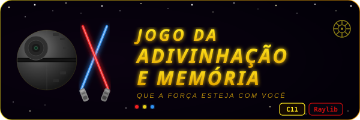<br>


[](https://github.com/viictorpaes/Jogo-da-Adivinhacao/blob/main/LICENSE)
[](https://github.com/viictorpaes/Jogo-da-Adivinhacao/actions)

</h1>

<h2 align="center">👥👨🏻‍🏫 Docentes Responsáveis: </h2>
<ul>
  <li><strong>Aêda Monalliza Cunha de Sousa</strong> <a href="https://www.linkedin.com/in/aedasousa/" target="_blank"></a></li>
  <li><strong>Guilherme Fernando Cacalvanti Pereira</strong> <a href="https://www.linkedin.com/in/guilherme-pereira-11a32511a" target="_blank"></a></li>
  <li><strong>Lucas Rodolfo Celestino de Farias</strong><a href="https://www.linkedin.com/in/fariaslrc" target="_blank"> </a></li>
  <li><strong>Renan Costa Alencar</strong><a href="https://www.linkedin.com/in/renancostaalencar" target="_blank"> </a></li>
  <li><strong>Ricardo Macedo Baudel</strong><a href="https://www.linkedin.com/in/ricardo-baudel-700a98127/" target="_blank"> </a></li>
</ul>


<h2 align="center">👤👨‍🎓 Integrantes do Projeto: </h2>
<ul>
<li><b>Lucas Paguetti Pereira (Líder 👑)</b> <a href="https://www.linkedin.com/in/lucas-paguetti-pereira" target="_blank"></a> <a href="https://github.com/wqiluc" target="_blank"></a></li>
<li>Eduardo de Souza Cavalcanti Junior <a href="https://www.linkedin.com/in/eduardoscavalcantij/" target="_blank"></a> <a href="https://github.com/eduardo-scavalcanti" target="_blank"></a></li>
<li>Felipe Franca Alves de Lima <a href="https://www.linkedin.com/in/felipefrancaal/" target="_blank"></a> <a href="https://github.com/ffrancaal" target="_blank"></a></li>
<li>Helamã Leone de Lima Procídio <a href="https://www.linkedin.com/in/helam%C3%A3-procidio-428772367/" target="_blank"></a> <a href="https://github.com/procidiohelama-star" target="_blank"></a></li>
<li>João Pedro Arruda Guimarães <a href="https://www.linkedin.com/in/jo%C3%A3o-pedro-arruda-guimar%C3%A3es-157952287/" target="_blank"></a> <a href="https://github.com/Jp230603" target="_blank"></a></li>
<li>Tiago Luiz Moreira de Vasconcelos <a href="https://www.linkedin.com/in/tiagoluiz23/" target="_blank"></a> <a href="https://github.com/tlmv23" target="_blank"></a></li>
<li>Victor José Paes e Silva <a href="https://www.linkedin.com/in/viictorpaes/" target="_blank"></a> <a href="https://github.com/viictorpaes" target="_blank"></a></li>
</ul>


<h2 align="center"> ⛏️💻 Tecnologias Utilizadas: </h2>
<p align="center">
   <br>
  
  
  
  
  
  
  
   <br>
  
  
   <br>
  
  
  
</p>

<h2 align="center">🖥️ Plataformas Disponíveis:</h2>
<p align="center">


</p>

<h2 align="center"><b>🛠️ Especificações Técnicas</b></h2>

<b>O projeto foi desenvolvido focando em modularização e boas práticas de programação em C:</b>

* **Modularização:** Divisão do código em arquivos `.h` (cabeçalhos) e `.c` (implementação) para facilitar a manutenção e organização lógica (Game, UI, History, Stats, Music).
* **6 modos de jogo:** Adivinhação Solo/VS, Memória Solo/VS (1v1), Protocolo Lógico (tabelas-verdade) e Hierarquia de Comandos (precedência lógica).
* **Gerenciamento de Memória:** Uso de estruturas de dados eficientes para manipulação de ranking e histórico sem vazamento de memória.
* **Persistência Multi-modo:** Seis pares de arquivos CSV/TXT independentes — um por modo de jogo — garantindo que o progresso não seja perdido ao fechar.
* **Timer por modo:** Contador regressivo em todos os modos (adivinhação, VS, memória, lógica e precedência), com bônus de tempo ao acertar pares na memória.
* **Algoritmo de Aleatoriedade:** Utilização da biblioteca `time.h` para garantir sementes de números aleatórios únicas a cada execução.


## 🚀 Como Executar o Projeto:

### Pré-requisitos

* **Compilador GCC**  
* **Git (Versionamento)**  
* **Padrão da Linguagem C**  
* **Raylib**  — necessário apenas para a versão gráfica (`make raylib`)


<h2 align="center">💻Instalação do Raylib<br>
</h2>

<h3>

</h3>

```bash
brew install raylib
```

<h3>

</h3>

```bash
sudo apt-get install libraylib-dev
```

<h3>
  MSYS2 / MinGW (recomendado)
</h3>

No terminal do **MSYS2 MinGW 64-bit**:

```bash
pacman -S mingw-w64-x86_64-raylib
```

Depois, `make raylib` funciona normalmente dentro do mesmo terminal MSYS2.

<h3>
  Instalação manual (sem MSYS2)
</h3>

Baixe os binários pré-compilados em [raylib.com/download](https://www.raylib.com/index.html), extraia (ex.: `C:\raylib`) e compile passando o caminho:

```bash
make RAYLIB_DIR=C:/raylib raylib
```

> [!TIP]
> **MSYS2 é o caminho mais simples no Windows** — instala GCC, Make e raylib de uma vez. Baixe em [msys2.org](https://www.msys2.org), instale, abra o terminal **MSYS2 MinGW 64-bit** e rode os `pacman` acima.

---

Após baixar o Github desktop: <br>


2. **Clone o repositório:**
   ```bash
   git clone https://github.com/viictorpaes/Jogo-da-Adivinhacao
   ```

4. **Abra sua IDE de escolha:** <br>   
  
5. **Siga os seguintes comandos 🕹️** <br>
   <ul>
  <li>
    <br>
    <code>Ctrl</code> + <code>j</code> (tecla de crase)
  </li> <br>
  <li>
     <br>
    <code>Ctrl</code> + <code>j</code> (tecla de crase)
  </li> <br>
  <li>
     <br>
    <code>Command</code> + <code>j</code> (tecla de crase)
  </li>
</ul> 


<h2 align="center">🕹️ Compilação e Execução<br>
</h2>

<h3>

</h3>

**Versão terminal:**
```bash
make run
```
**Versão visual (RayLib):**
```bash
make raylib
```

<h3>

</h3>

**Versão terminal:**
```bash
make run
```
**Versão visual (RayLib):**
```bash
make raylib
```

<h3>
  MSYS2 / MinGW (recomendado)
</h3>

No terminal do **MSYS2 MinGW 64-bit**, os comandos são idênticos:

**Versão terminal:**
```bash
make run
```
**Versão visual (RayLib):**
```bash
make raylib
```

<h3>
  Instalação manual (sem MSYS2)
</h3>

**Versão terminal:**
```bash
make run
```
**Versão visual (RayLib) — passe o caminho onde o raylib foi extraído:**
```bash
make RAYLIB_DIR=C:/raylib raylib
```

> [!NOTE]
> Para compilar **sem executar**: `make` (terminal) ou `make build-raylib` (visual).
> Para compilar em **modo debug**: `make DEBUG=1 run` ou `make DEBUG=1 raylib`.
> Para remover os binários gerados: `make clean`.

#### 🛠️ Referência rápida de comandos

| Comando | Descrição |
| :--- | :--- |
| `make` | Compila a versão terminal |
| `make run` | Compila e executa a versão terminal |
| `make build-raylib` | Compila a versão visual sem executar |
| `make raylib` | Compila e executa a versão visual |
| `make DEBUG=1` | Compila com símbolos de debug (`-g -O0`) |
| `make RAYLIB_DIR=C:/raylib raylib` | Windows sem MSYS2: raylib instalado manualmente |
| `make clean` | Remove binários compilados |
| `make format` | Formata o código com clang-format |
| `make help` | Lista todos os alvos disponíveis |

### 🎮🟢🟡🔴 Níveis de Dificuldade

A dificuldade selecionada altera o intervalo de números, o número de tentativas e o tempo por rodada, recompensando a precisão com pontuações maiores.

#### Adivinhação & VS
| Nível | Patente | Intervalo | Tentativas | Timer |
| :--- | :--- | :---: | :---: | :---: |
| **Fácil**  | Cadete     | `1 a 10`  | 5  | 15s / palpite |
| **Médio**  | Piloto     | `1 a 50`  | 8  | 15s / palpite |
| **Difícil**| Comandante | `1 a 100` | 10 | 15s / palpite |

#### Protocolo Lógico & Hierarquia de Comandos
| Nível | Questões | Tempo / questão |
| :--- | :---: | :---: |
| **Fácil**  | 8  | 60s |
| **Médio**  | 10 | 40s |
| **Difícil**| 12 | 35s |

### 📡🚀🌌🔭 Sistema de Feedback Espacial

Para tornar a jogabilidade mais imersiva, o jogo utiliza um sistema de proximidade baseado na estabilidade do sinal em órbita. O feedback é calculado pela diferença absoluta ($|palpite - secreto|$):

| Feedback | Condição (Distância) | Descrição |
| :--- | :--- | :--- |
| **Sinal estabelecido! Resgate a caminho!** 📡 | $\pm 1$ | Você está a apenas uma unidade do número! |
| **Frequência muito próxima!** 🔭 | $\leq 5$ | Você está muito perto, o acerto é iminente. |
| **Sinal detectado!** 📶 | $\leq 15$ | Você está na vizinhança correta do número. |
| **Interferência estática...** 🌌 | $> 15$ | Você ainda está longe do objetivo. |

> [!IMPORTANT]
> Além da temperatura, o jogo continuará informando se o número secreto é **maior** ou **menor** que o palpite, auxiliando na estratégia de busca do jogador.

### 💎 Por que o C11 é fundamental neste projeto?

Diferente de versões legadas (como C89/C90), o C11 introduz recursos que garantem que o jogo seja robusto e pronto para sistemas modernos:

| Recurso ⛏️| Benefício para o Projeto ✅ |
| :--- | :--- |
| **Segurança de Memória** | Substituição de funções perigosas (como `gets`) por alternativas que evitam *Buffer Overflow*. |
| **Macros Genéricas (`_Generic`)** | Permite que funções utilitárias lidem com diferentes tipos de dados de forma mais inteligente. |
| **Alinhamento de Dados** | Otimização do uso de memória e cache, tornando o processamento de estatísticas mais rápido. |
| **Tipagem Estrita** | Garante que o histórico de partidas gravado no disco seja lido sem corrupção de tipos. |

### 🏗️ Modularizção e Boas Práticas

* **Modularização (Encapsulamento):** O código é dividido em camadas lógicas. O módulo `game/` não precisa saber como o módulo `history/` grava os arquivos; ele apenas consome a interface (API) definida no `.h`.
* **Gerenciamento de Fluxo:** Uso de estruturas de controle otimizadas para o loop de adivinhação, garantindo baixa latência de resposta no terminal.
* **Persistência de Dados:** Implementação de manipulação de arquivos (I/O) com tratamento de erros rigoroso, prevenindo perda de dados caso o programa seja interrompido abruptamente.
* **Portabilidade:** O código é compatível com compiladores GCC, Clang e MSVC, podendo ser compilado em ambientes Linux, Windows ou macOS sem alterações no núcleo da lógica.


| Flag de Compilação ⚙️ | Impacto no Desenvolvimento 🚀 |
| :--- | :--- |
| **Standard C11 (`-std=c11`)** | Habilita recursos modernos da revisão de 2011 e garante portabilidade do código. |
| **All Warnings (`-Wall`)** | Ativa alertas sobre os erros mais comuns, como variáveis declaradas e não utilizadas. |
| **Extra Warnings (`-Wextra`)** | Habilita verificações rigorosas de lógica que o padrão `-Wall` pode acabar ignorando. |
| **Optimization (`-O2`)** | Otimiza o código para uma execução mais veloz sem comprometer o tamanho do binário. |
| **Strict Mode (`-Werror`)** | Trata avisos como erros fatais, impedindo a compilação de códigos considerados "sujos". |
| **Debug Mode (`-g`)** | Inclui símbolos de depuração essenciais para o uso de ferramentas como GDB ou Valgrind. |


| Pilar de Qualidade 🏗️ | Objetivo Técnico ✅ |
| :--- | :--- |
| **Modularização** | Divisão em arquivos `.h` e `.c`, facilitando a manutenção e a organização das funções. |
| **Segurança de I/O** | Uso de `fgets()` e `strncmp()` para proteger contra *Buffer Overflow* e falhas de leitura. |
| **Gestão de Memória** | Gerenciamento dinâmico consciente para evitar vazamentos (*Memory Leaks*) no ranking. |
| **Tratamento de Erros** | Verificação de `fopen()` para evitar que o programa feche se o arquivo de dados sumir. |
| **Legibilidade** | Uso de nomes de variáveis claros para que a lógica seja entendida sem esforço extra. |


> [!NOTE]
> **Potencialize seu Workflow:** Instale a extensão oficial [**Makefile Tools**](https://marketplace.visualstudio.com/items?itemName=ms-vscode.makefile-tools) da Microsoft no seu VS Code. 
> 
> Ela adiciona botões de **"Play"** e **"Debug"** na sua barra de status que leem automaticamente as regras de compilação do projeto, facilitando o gerenciamento da nossa arquitetura modular sem a necessidade de comandos manuais no terminal (se preferir).
>
> 


> [!IMPORTANT]
> **Padronização e Qualidade de Código:** Automatize a estética técnica do projeto.
> 
> A presença dos arquivos **`.clang-format`** e **`.prettierrc`** na raiz do repositório garante que a formatação do código seja tratada como infraestrutura, não como preferência pessoal. Isso elimina ruídos em *Code Reviews* e assegura que 100% da base de código mantenha uma identidade visual única e profissional.
>
>  

---

### 🛠️ O papel de cada ferramenta

* **`.clang-format` (C/C++):** Gerencia a complexidade sintática de linguagens de baixo nível. Define o alinhamento de ponteiros, quebras de macros e indentação de *namespaces*, seguindo padrões rigorosos (LLVM/Google).
* **`.prettierrc` (Web & Config):** Atua em arquivos de configuração (JSON, YAML) e documentação (Markdown). Sua filosofia "opinativa" garante que o layout do código seja previsível e extremamente legível.

### 🚀 Por que isso é indispensável?

| Benefício | Descrição |
| :--- | :--- |
| **Diffs Semânticos** | Alterações no Git mostram apenas mudanças de lógica, sem "lixo" visual de espaços ou tabs. |
| **Zero Atrito** | Novos desenvolvedores performam imediatamente sem precisar estudar guias de estilo manuais. |
| **Manutenibilidade Eficiente** | Código padronizado é mais rápido de ler, diagnosticar, corrigir e debugar. |

> Instale as extensões oficiais [**Prettier - Code formatter**](https://marketplace.visualstudio.com/items?itemName=esbenp.prettier-vscode) e [**C/C++**](https://marketplace.visualstudio.com/items?itemName=ms-vscode.cpptools) da Microsoft no seu VS Code para habilitar o suporte total aos arquivos de configuração.
>

<h2 align="center">🏰 Arquitetura do Projeto <br>
</h2>
<pre>
Jogo-da-Adivinhacao/
├── .gitignore 
├── .clang-format 
├── .prettierrc 
├── Makefile 
├── protótipo.fig 
├── README.md 
├── LICENSE 
├── docs /
│   ├── ADR.md 
│   ├── API.md 
│   ├── ARCHITECTURE.md 
│   ├── CONTRIBUTING.md 
│   ├── FRONTEND_RAYLIB.md 
│   ├── GAMES.md 
│   ├── Histórias_de_Usuário.md 
│   ├── CHANGELOG.md 
│   ├── schema.md 
│   ├── SECURITY.md 
│   ├── ROADMAP.md 
│   └── Regras_Evento.md 
├── img /
├── data /
│   ├── historico.csv / .txt 
│   ├── historico_memoria.csv / .txt 
│   ├── historico_vs.csv / .txt 
│   ├── historico_memoria_vs.csv / .txt 
│   ├── historico_logica.csv / .txt 
│   └── historico_precedencia.csv / .txt  
└── src src-111827?style=flat-square&logo=visualstudiocode&logoColor=007ACC" height="18"/>/
    ├── main.c 
    ├── main_raylib.c 
    ├── game /
    │   ├── jogo.c 
    │   ├── jogo.h 
    │   ├── memorygame.c 
    │   ├── memorygame.h 
    │   ├── jogar_memoria.c 
    │   ├── jogar_memoria.h 
    │   ├── logica.c 
    │   ├── logica.h 
    │   ├── precedencia.c 
    │   ├── precedencia.h 
    │   ├── jogos_extras.c 
    │   └── jogos_extras.h 
    ├── ui /
    │   ├── menu.c  
    │   ├── menu.h 
    │   ├── frontend.c  
    │   └── frontend.h 
    ├── ux /
    │   ├── acessibilidade.md 
    │   ├── jogar.md 
    │   ├── jornadas.md 
    │   └── personas.md  
    ├── history /
    │   ├── historico.c 
    │   └── historico.h 
    ├── utils /
    │   ├── utils.c 
    │   └── utils.h 
    ├── static/
    │   ├── estatisticas.c 
    │   └── estatisticas.h 
    ├── music /
    │   ├── musica.c 
    │   ├── musica.h 
    │   └── StarWarsMainTheme.mp3 
    └── include /
        └── tipos.h 
</pre>


<h3 align="center"> 🚀 Backlog e Boarding (Trello) </h3>
<p align="center">
  <strong>Status:</strong> 28 histórias de usuário implementadas e 16 futuras, definidas seguindo o padrão 3Cs e priorizadas no backlog.
</p>

<p align="center">
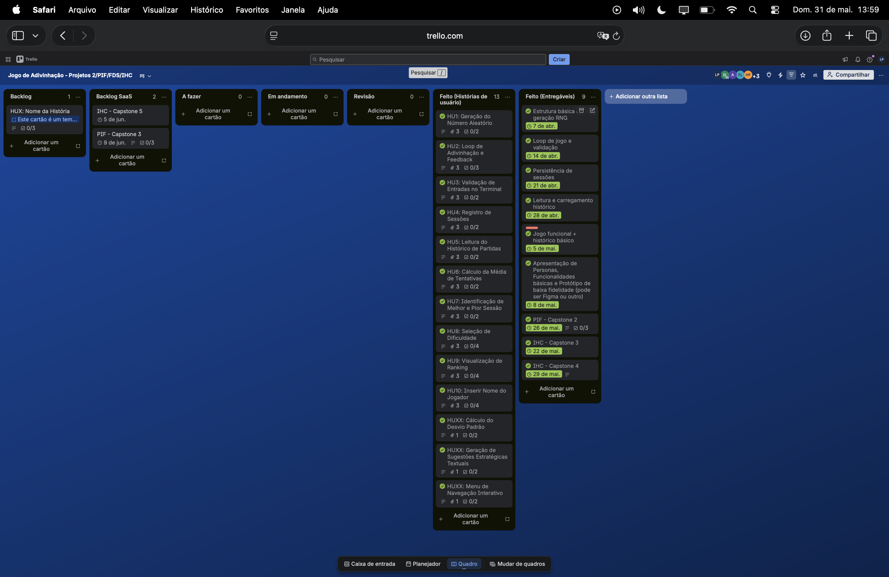
</p>

<p align="center">
  <strong>Acesse o Board do projeto e o documento completo de HUs Implementadas</strong>: <br>
  <a href="https://trello.com/b/yp8S6Ek9/jogo-de-adivinhacao-projetos-2-pif-fds" target="_blank">
    
  </a>
  <a href="./docs/Histórias_de_Usuário.md" target="_blank">
    
  </a>
</p>

<h3 align="center">🎨 Diagramas, Protótipos e Validação de UX</h3>
<p align="center">
  <strong>Entrega 1 e 2 - Demonstração do Protótipo (Screencast):</strong> <br>
  <a href="https://www.youtube.com/watch?v=OtLZ7gIEQFQ" target="_blank">
    
  </a>
  <a href="https://www.figma.com/pt-br/comunidade/file/1623063562663924122/cesarnumber-v1" target="_blank">
    
  </a>
</p>

<p align="center">
 <strong>Entrega 3 - Demonstração do Jogo via Raylib (Screencast 2):</strong> <br>
  <a href="https://youtu.be/mInsL-gVaTs" target="_blank">
    
  </a>
  <a href="#" target="_blank" height="25">
  </a>
</p>

<p align="center">
 <strong>Entrega 04 — Novas Histórias + Deploy (Screencast 3):</strong> <br>
  <a href="ADICIONAR_URL_SCREENCAST_AQUI" target="_blank">
    
  </a>
  <a href="https://github.com/viictorpaes/Jogo-da-Adivinhacao/releases/latest" target="_blank">
    
  </a>
</p>

<h3 align="center">🚀 Deploy</h3>

<p align="center">
  <strong>Binários compilados disponíveis via GitHub Releases:</strong><br>
  <a href="https://github.com/viictorpaes/Jogo-da-Adivinhacao/releases/latest" target="_blank">
  
  </a>
</p>

<p align="center">
  <b>Baixe o executável pré-compilado para o seu sistema operacional diretamente na página de releases.<br>
  A URL 🔗 aparece no Screencast 3 (Entrega 04).</b>
</p>

<h2 align="center">Telas 📱 <br></h2>

<table align="center" width="780">
  <tr><th align="center">🏠 Tela Inicial</th></tr>
  <tr><td align="center"><b>Menu principal — o jogador escolhe entre os seis modos de missão (Solo/VS) e acessa Histórico, Estatísticas ou sai do jogo.</b></td></tr>
  <tr><td align="center">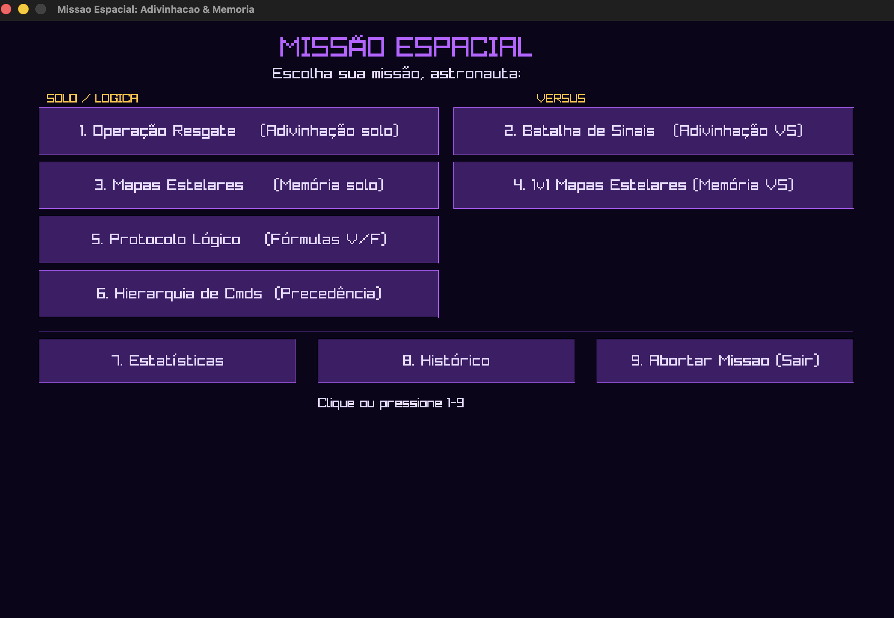</td></tr>
</table>

<br>

<table align="center" width="780">
  <tr><th align="center">✏️ Identificação do Astronauta</th></tr>
  <tr><td align="center"><b>Cadastro do jogador — insira seu nome antes de iniciar qualquer missão solo; o campo exibe autocomplete com nomes já salvos no histórico.</b></td></tr>
  <tr><td align="center">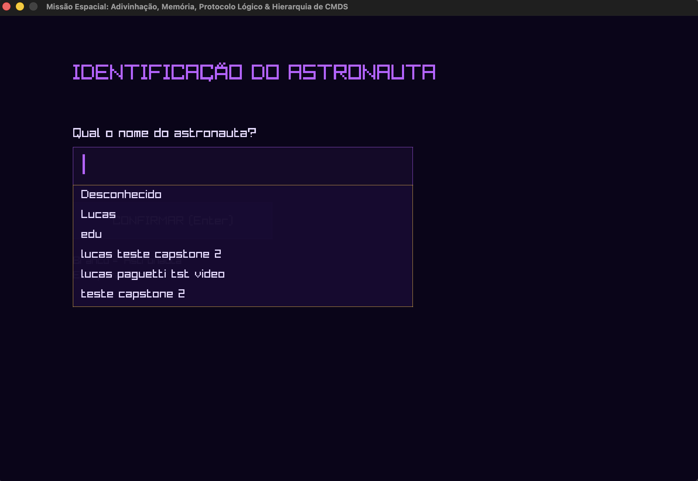</td></tr>
</table>

<br>

<table align="center" width="780">
  <tr><th align="center">🎯 Selecionar Patente — Operação Resgate</th></tr>
  <tr><td align="center"><b>Seleção de dificuldade para Adivinhação Solo — Cadete (1-10, 5 tent., 60 s), Piloto (1-50, 8 tent., 40 s) ou Comandante (1-100, 10 tent., 35 s). Cada acerto bônus +15 s, erro −5 s.</b></td></tr>
  <tr><td align="center">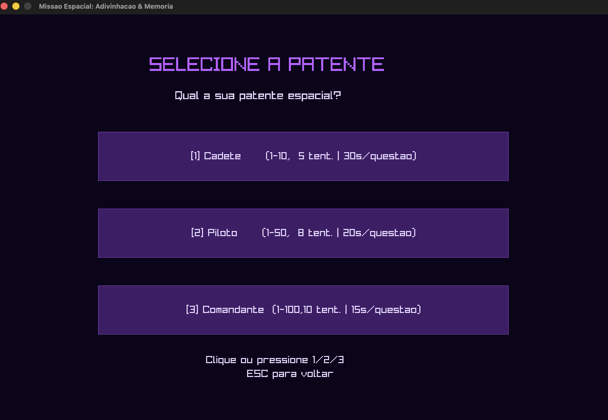</td></tr>
</table>

<br>

<table align="center" width="780">
  <tr><th align="center">🚀 Operação Resgate — Gameplay</th></tr>
  <tr><td align="center"><b>Loop de adivinhação — campo de entrada do palpite com barra de tempo regressiva (verde &gt;50 %, laranja 20–50 %, vermelho &lt;20 %). Patente, range e tentativas exibidos no cabeçalho.</b></td></tr>
  <tr><td align="center">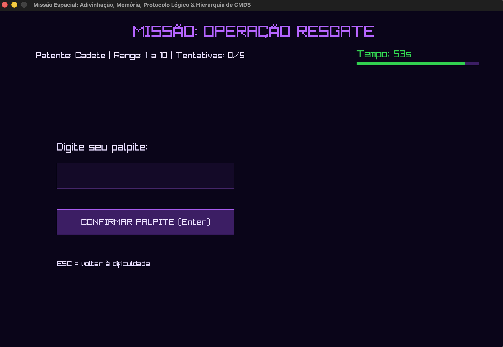</td></tr>
</table>

<br>

<table align="center" width="780">
  <tr><th align="center">📡 Operação Resgate — Feedback de Sinal</th></tr>
  <tr><td align="center"><b>Feedback de proximidade após cada palpite — a mensagem indica a distância ao número secreto segundo o sistema de sinais espaciais (Muito longe / Sinal detectado / Frequência muito próxima / Sinal estabelecido).</b></td></tr>
  <tr><td align="center">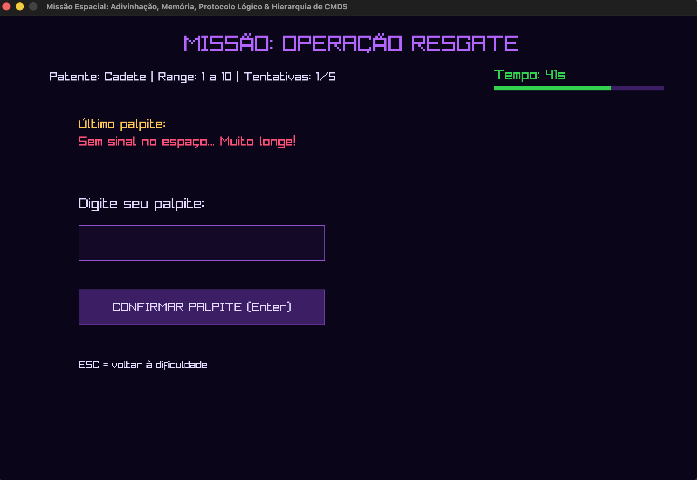</td></tr>
</table>

<br>

<table align="center" width="780">
  <tr><th align="center">🏁 Fim da Missão — Resultado</th></tr>
  <tr><td align="center"><b>Tela de resultado ao acertar ou esgotar tentativas — exibe astronauta, patente, número secreto, tentativas usadas, pontos ganhos, heurística estratégica e opções de avançar de patente, permanecer, ver histórico ou voltar ao menu.</b></td></tr>
  <tr><td align="center">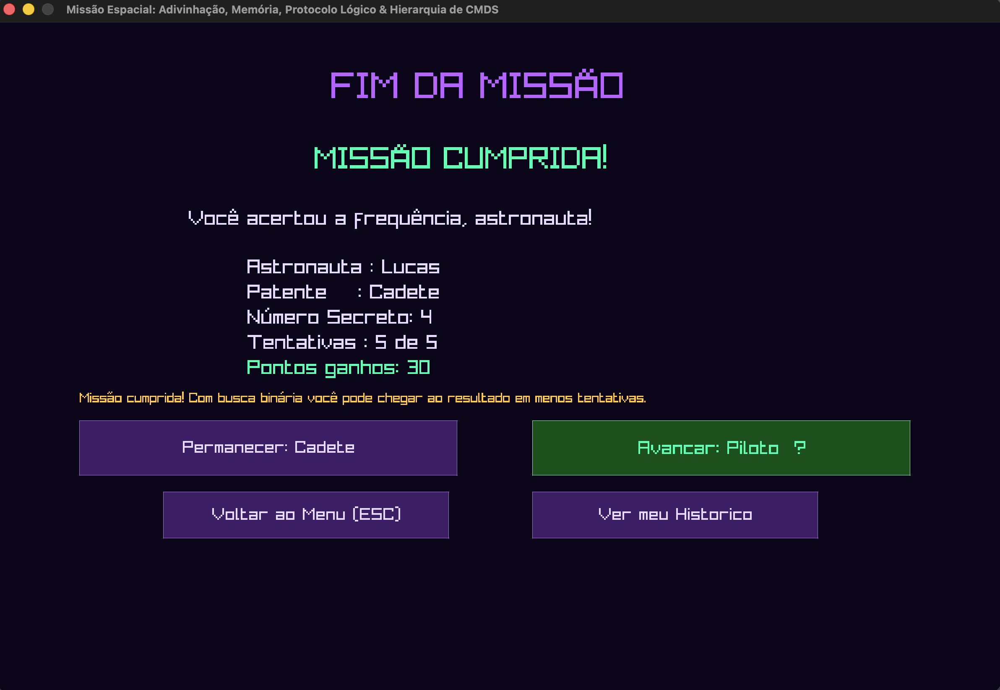</td></tr>
</table>

<br>

<table align="center" width="780">
  <tr><th align="center">🧠 Mapas Estelares (Solo)</th></tr>
  <tr><td align="center"><b>Modo memória single-player — encontre os pares de coordenadas estelares no grid 4×4 dentro do timer regressivo. Quanto menos jogadas, maior a pontuação.</b></td></tr>
  <tr><td align="center">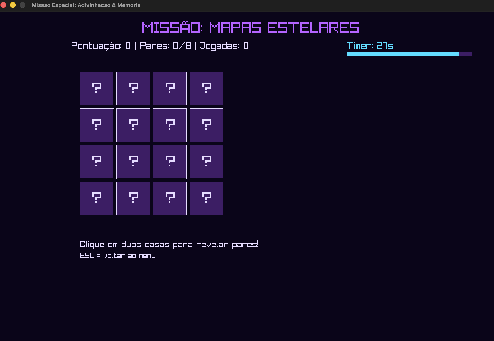</td></tr>
</table>

<br>

<table align="center" width="780">
  <tr><th align="center">🔬 Selecionar Patente — Protocolo Lógico</th></tr>
  <tr><td align="center"><b>Seleção de dificuldade para o modo de fórmulas lógicas — Cadete (8 questões, 60 s), Piloto (10 questões, 40 s) ou Comandante (12 questões, 35 s).</b></td></tr>
  <tr><td align="center">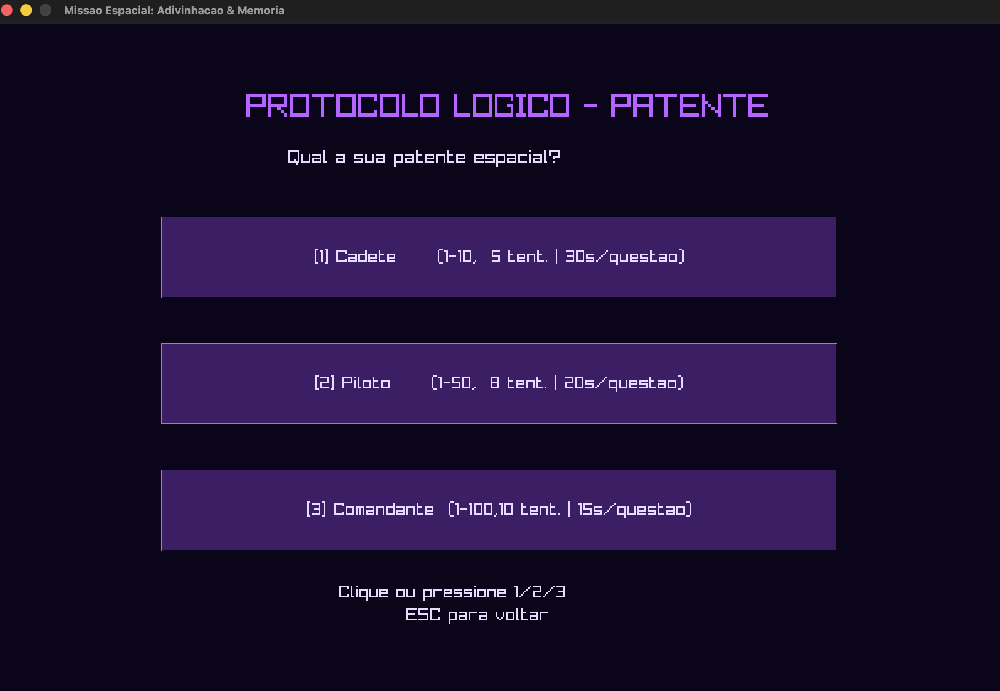</td></tr>
</table>

<br>

<table align="center" width="780">
  <tr><th align="center">🔬 Protocolo Lógico — Avaliação V/F</th></tr>
  <tr><td align="center"><b>Primeira etapa por questão — avalie se a fórmula proposicional exibida (com legenda de operadores) é Verdadeira ou Falsa para os valores de P e Q apresentados, dentro do tempo limite.</b></td></tr>
  <tr><td align="center">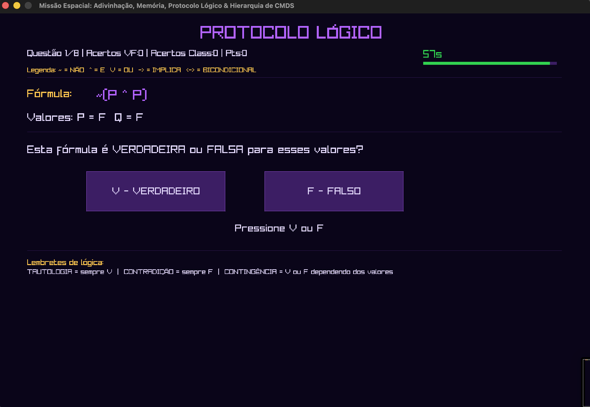</td></tr>
</table>

<br>

<table align="center" width="780">
  <tr><th align="center">🔬 Protocolo Lógico — Classificação da Fórmula</th></tr>
  <tr><td align="center"><b>Segunda etapa por questão — após acertar o valor V/F, classifique a fórmula como Tautologia (sempre V), Contradição (sempre F) ou Contingência (depende dos valores). Pontuação acumulada exibida no cabeçalho.</b></td></tr>
  <tr><td align="center">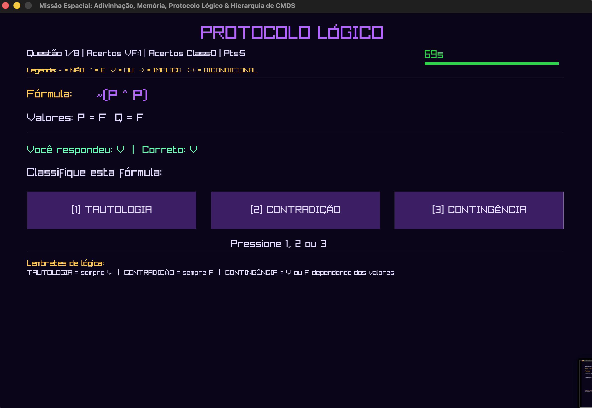</td></tr>
</table>

<br>

<table align="center" width="780">
  <tr><th align="center">⚙️ Selecionar Patente — Hierarquia de Comandos</th></tr>
  <tr><td align="center"><b>Seleção de dificuldade para o modo de precedência lógica — Cadete (8 questões, 60 s), Piloto (10 questões, 40 s) ou Comandante (12 questões, 35 s).</b></td></tr>
  <tr><td align="center">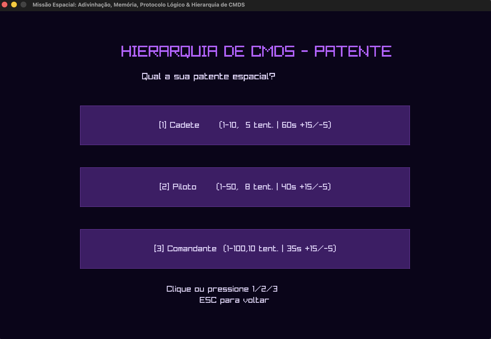</td></tr>
</table>

<br>

<table align="center" width="780">
  <tr><th align="center">⚙️ Hierarquia de Comandos</th></tr>
  <tr><td align="center"><b>Modo de precedência lógica — adicione parênteses para indicar a precedência correta dos operadores na fórmula exibida, escolhendo entre quatro alternativas. A ordem de precedência (~ &gt; ^ &gt; ∨ &gt; → &gt; ↔) é exibida como legenda.</b></td></tr>
  <tr><td align="center">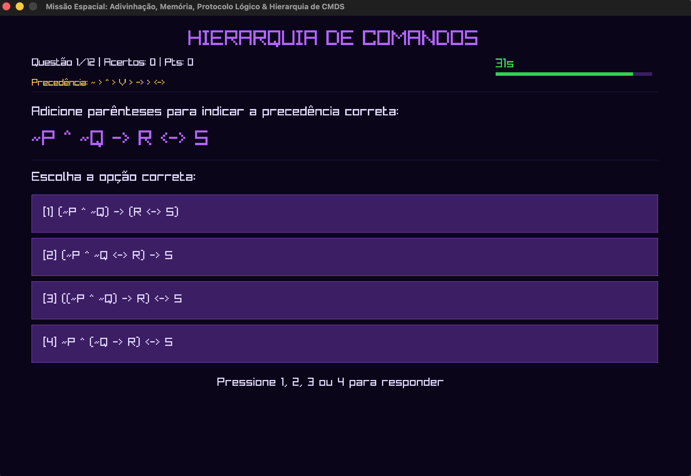</td></tr>
</table>

<br>

<table align="center" width="780">
  <tr><th align="center">⚔️ Identificação — Astronauta 2 (VS)</th></tr>
  <tr><td align="center"><b>Cadastro do segundo jogador no modo Versus — insira o nome do Astronauta 2 com autocomplete do histórico para completar a dupla antes de iniciar a Batalha de Sinais ou o 1v1 Mapas Estelares.</b></td></tr>
  <tr><td align="center">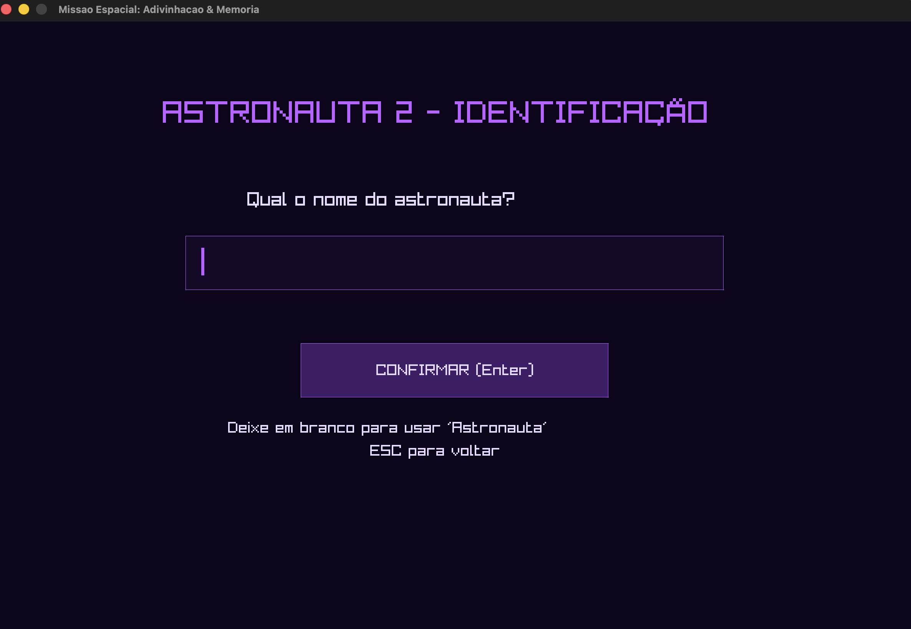</td></tr>
</table>

<br>

<table align="center" width="780">
  <tr><th align="center">⚔️ Batalha de Sinais — 1v1 (Turno do Astronauta 1)</th></tr>
  <tr><td align="center"><b>Adivinhação Versus — turno do Astronauta 1; o placar lateral mostra de quem é a vez com destaque "<-- SUA VEZ", enquanto o timer conta regressivamente. Tentativas compartilhadas por rodada.</b></td></tr>
  <tr><td align="center">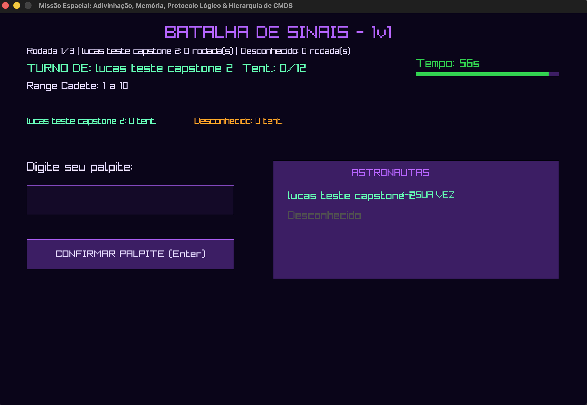</td></tr>
</table>

<br>

<table align="center" width="780">
  <tr><th align="center">⚔️ Batalha de Sinais — 1v1 (Turno do Astronauta 2)</th></tr>
  <tr><td align="center"><b>Adivinhação Versus — turno do Astronauta 2; o feedback do palpite anterior ("Sem sinal no espaço…") é exibido em vermelho, e o placar lateral atualiza o indicador de vez automaticamente.</b></td></tr>
  <tr><td align="center">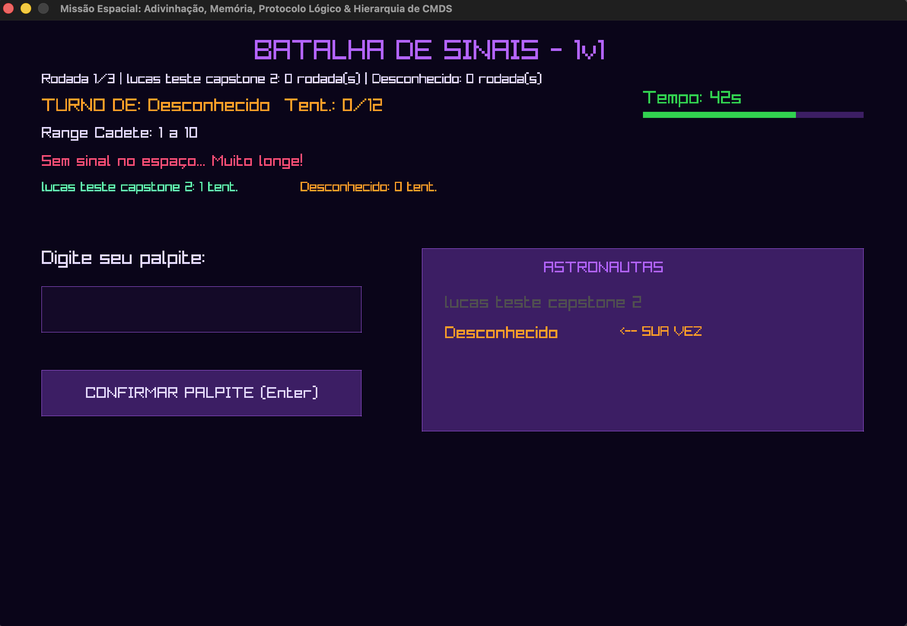</td></tr>
</table>

<br>

<table align="center" width="780">
  <tr><th align="center">📊 Estatísticas de Missões</th></tr>
  <tr><td align="center"><b>Painel de desempenho global — exibe partidas, vitórias, médias, mínimos, máximos e desvio padrão por modo (Adivinhação, Memória, VS, Lógica, Precedência), além do ranking geral de pontos de todos os modos.</b></td></tr>
  <tr><td align="center">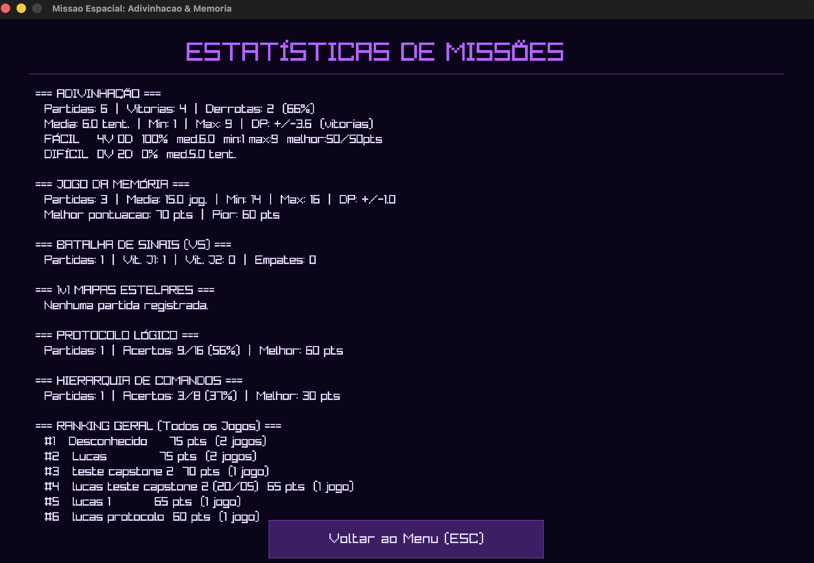</td></tr>
</table>

<br>

<table align="center" width="780">
  <tr><th align="center">📜 Histórico de Missões</th></tr>
  <tr><td align="center"><b>Registro completo em colunas por modo — Adivinhação Solo, Mapas Estelares, Protocolo Lógico, Batalha de Sinais VS, 1v1 Mapas Estelares e Hierarquia de Comandos — com data, nome, dificuldade, tentativas e pontuação de cada sessão.</b></td></tr>
  <tr><td align="center">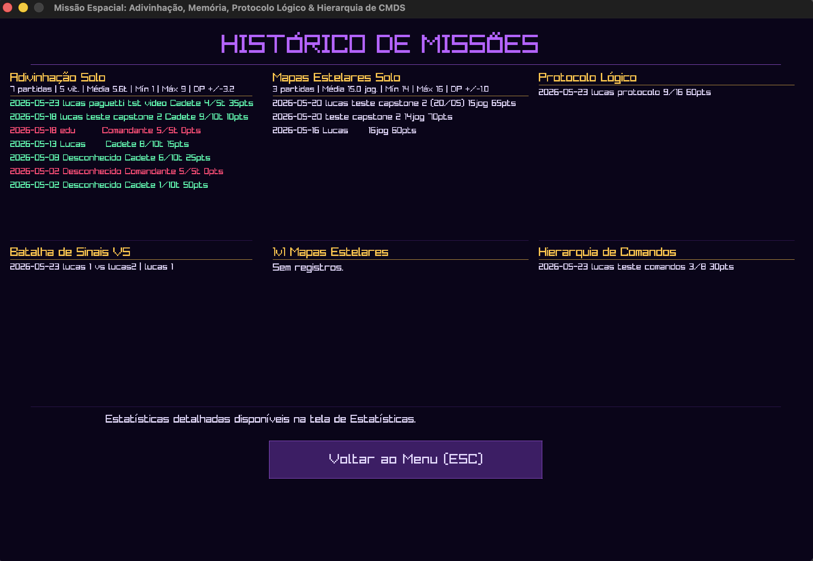</td></tr>
</table>

<h2 align="center">🐛 Issue / Bug Tracker</h2>

<p align="center">
  <b>Rastreamento de bugs e melhorias. Gerenciado via <strong>GitHub Issues</strong>:
  <br><br>
  <a href="https://github.com/viictorpaes/Jogo-da-Adivinhacao/issues" target="_blank">
    
  </a>
</p>

<table align="center" width="780">
  <tr><th align="center">📋 Quadro de Issues — Visão 1</th></tr>
  <tr><td align="center"><b>Visão geral das issues abertas e em andamento no repositório.</b></td></tr>
  <tr><td align="center">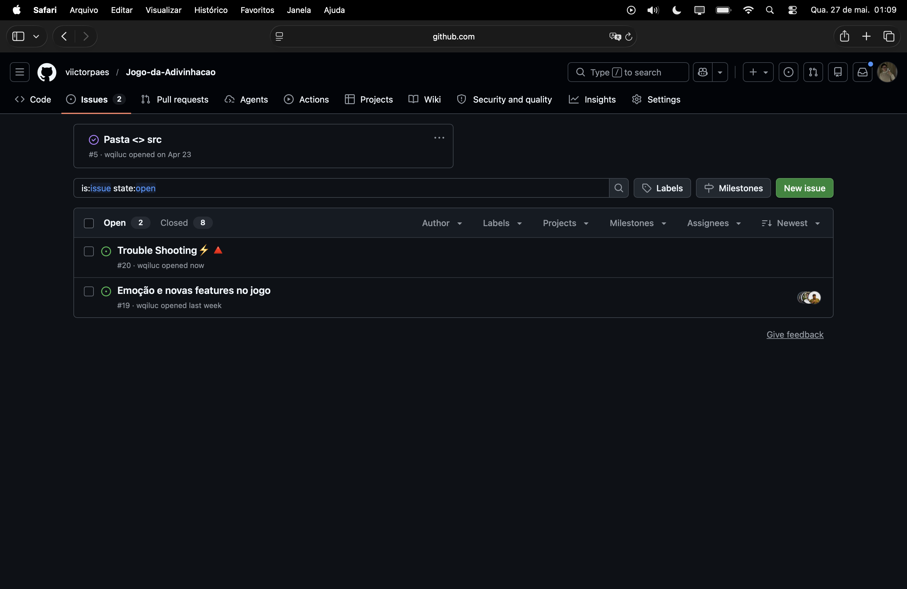</td></tr>
</table>

<br>

<table align="center" width="780">
  <tr><th align="center">📋 Quadro de Issues — Visão 2</th></tr>
  <tr><td align="center"><b>Visão geral das issues fechadas e histórico de resoluções no repositório.</b></td></tr>
  <tr><td align="center">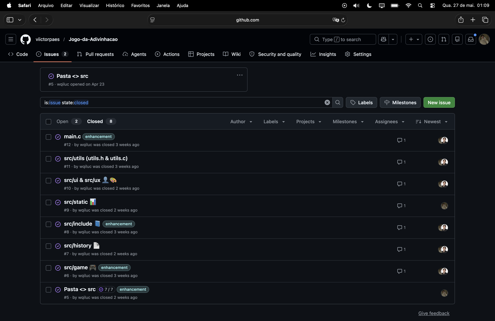</td></tr>
</table>


<h2 align="center">🧪 Testes de Sistema</h2>

<p align="center">
  O plano completo de testes (20 casos de teste, 95% de cobertura) está documentado em
  <a href="./docs/CHANGELOG.md"><strong>docs/CHANGELOG.md</strong></a>.
</p>

 Módulo | Casos | Aprovados | Cobertura |
| :--- | :---: | :---: | :---: |
| Adivinhação | 5 | 5 | 100% |
| Memória | 4 | 4 | 100% |
| Histórico | 3 | 3 | 100% |
| Estatísticas | 6 | 6 | 100% |
| Regressão | 2 | 1 | 50% |
| **Total** | **20** | **19** | **95%** |

<br>


<h2 align="center">🤝💻 Programação em Par</h2>

> Relato de quais duplas trabalharam juntas e quais funcionalidades cada par implementou, conforme prática de *Pair Programming* adotada nas Entregas 03 e 04.

### Entrega 03

| Par | Funcionalidades Implementadas |
| :--- | :--- |
| **Lucas Paguetti + Victor Paes** | Liderança técnica do projeto — revisões de código, code review geral e integração dos módulos |
| **Helamã Procídio + Eduardo Cavalcanti** | Capstone 1 — módulo de lógica proposicional (`logica.c`, `precedencia.c`) e frontend gráfico Raylib (`frontend.c`) |
| **Felipe Franca** | Módulo de estatísticas (`estatisticas.c`) — funções recursivas de soma, mínimo, máximo e desvio padrão |
| **Tiago Vasconcelos + João Pedro Arruda** | Implementação de features e novas Histórias de Usuário (modos VS, persistência e ranking) |

### Entrega 04

| Par | Funcionalidades Implementadas |
| :--- | :--- |
| **Lucas Paguetti + Victor Paes** | Refatoração geral de timers — introdução de `TIMER_ADIV_BONUS`, `TIMER_ADIV_PENALIDADE` e `timer_adiv_para_dif()` em `tipos.h`; revisão de nomenclatura em todos os módulos; integração final dos 6 modos no Raylib |
| **Helamã Procídio + Eduardo Cavalcanti** | Timer independente por jogador no modo VS Memória (`memorygame.c`) e carry de timer entre fases; ajustes visuais no frontend gráfico (`frontend.c`) |
| **Felipe Franca + Tiago Vasconcelos** | Filtro por nome no histórico — implementação de `hist_filtro_nome`, `hist_com_filtro` e lista de autocomplete `nomes_hist[]` no módulo `history/` |
| **João Pedro Arruda** | Ajustes no `Makefile` para compatibilidade com Windows (MSYS2/MinGW) e Linux (Ubuntu); testes de compilação multiplataforma |

<br>

---

<h2 align="center"> LICENSE <br>
<a href="LICENSE"></a>
</h2>

```license
MIT License

Copyright (c) 2026, Lucas Paguetti Pereira, Eduardo de Souza Cavalcanti Junior,
Felipe Franca Alves de Lima, Helamã Leone de Lima Procídio,
João Pedro Arruda Guimarães, Tiago Luiz Moreira de Vasconcelos,
Victor José Paes e Silva

Permission is hereby granted, free of charge, to any person obtaining a copy
of this software and associated documentation files (the "Software"), to deal
in the Software without restriction, including without limitation the rights
to use, copy, modify, merge, publish, distribute, sublicense, and/or sell
copies of the Software, and to permit persons to whom the Software is
furnished to do so, subject to the following conditions:

The above copyright notice and this permission notice shall be included in all
copies or substantial portions of the Software.

THE SOFTWARE IS PROVIDED "AS IS", WITHOUT WARRANTY OF ANY KIND, EXPRESS OR
IMPLIED, INCLUDING BUT NOT LIMITED TO THE WARRANTIES OF MERCHANTABILITY,
FITNESS FOR A PARTICULAR PURPOSE AND NONINFRINGEMENT. IN NO EVENT SHALL THE
AUTHORS OR COPYRIGHT HOLDERS BE LIABLE FOR ANY CLAIM, DAMAGES OR OTHER
LIABILITY, WHETHER IN AN ACTION OF CONTRACT, TORT OR OTHERWISE, ARISING FROM,
OUT OF OR IN CONNECTION WITH THE SOFTWARE OR THE USE OR OTHER DEALINGS IN THE
SOFTWARE.
```