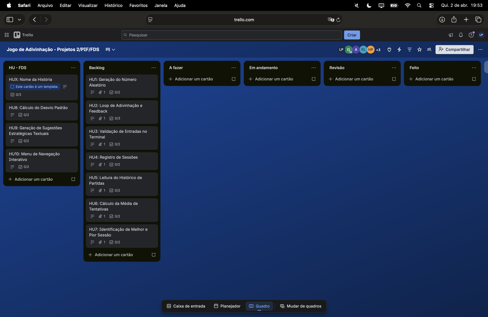

<h1 align="center">
Jogo de Adivinhação Otimizado em C  
 

</h1>

<h2 align="center">👥👨🏻‍🏫 Docentes Responsáveis: </h2>
<ul>
  <li><strong>Aêda Monalliza Cunha de Sousa</strong> </li>
  <li><strong>Lucas Rodolfo Celestino de Farias</strong></li>
  <li><strong>Renan Costa Alencar</strong></li>
  <li><strong>Ricardo Baudel</strong></li>
</ul>

<h2 align="center">👤👨‍🎓 Integrantes do Projeto: </h2>
<ul>
<li>Eduardo de Souza Cavalcanti Junior  </li>
<li>Felipe Franca Alves de Lima  </li>
<li>Helamã Leone de Lima Procídio  </li>
<li>João Pedro Arruda Guimarães  </li>
<li>Lucas Paguetti Pereira  </li>
<li>Tiago Luiz Moreira de Vasconcelos  </li>
<li>Victor José Paes  </li>
</ul>

<h2 align="center"> 🔨💻 Tecnologias Utilizadas: </h2>

  
  
  
  
    
  
  
  

🛠️ Especificações Técnicas:
...

<h2 align="center">🏰 Arquitetura do Projeto: </h2>
<pre>
Jogo-da-Adivinhacao/
├── README.md 
├── img/ 
├── dados/ 
│   └── historico.txt 
├── src/ 
│   ├── jogo/ 
│   │   ├── jogo.c 
│   │   └── jogo.h 
│   ├── util/ 
│   │   ├── util.c 
│   │   └── util.h 
│   ├── historico/ 
│   │   ├── historico.c 
│   │   └── historico.h 
│   ├── analise/ 
│   │   ├── analise.c 
│   │   └── analise.h 
│   ├── tipos/ 
│   │   └── tipos.h 
│   └── main.c 
</pre>

<h3 align="center"> 🚀 Backlog e Boarding (Trello) </h3>

  <strong>Status:</strong> Mínimo de 10 histórias de usuário definidas seguindo o padrão 3Cs e priorizadas no backlog.

    

  <strong>Acesse o Board do projeto</strong>:  
  

<h3 align="center"> 🎨 UX Design e Engenharia de Requisitos </h3>

  <strong>Demonstração do Protótipo (Screencast):</strong>  
  

<h2 align="center"> 📐 Mapeamento de Fluxos e Atividades</h2>

  <strong>Detalhamento visual das 10 Histórias de Usuário (HUs) através de diagramas de atividades e wireframes.  
  Também disponíveis nos cards do Trello</strong>

  <strong>HU1</strong> 
  Lorem ipsum dolor sit amet, consectetur adipiscing elit. Ut enim ad minim veniam, quis nostrud exercitation ullamco laboris nisi ut aliquip. 
  

  <strong>HU2</strong> 
  Sed do eiusmod tempor incididunt ut labore et dolore magna aliqua. Ut enim ad minim veniam, quis nostrud exercitation ullamco laboris nisi. 
  

  <strong>HU3</strong> 
  Duis aute irure dolor in reprehenderit in voluptate velit esse cillum dolore eu fugiat nulla pariatur. Excepteur sint occaecat cupidatat non proident. 
  

  <strong>HU4</strong> 
  Sunt in culpa qui officia deserunt mollit anim id est laborum. Ut enim ad minim veniam, quis nostrud exercitation ullamco laboris nisi ut. 
  

  <strong>HU5</strong> 
  At vero eos et accusamus et iusto odio dignissimos ducimus qui blanditiis praesentium voluptatum deleniti atque corrupti quos dolores et quas. 
  

  <strong>HU6</strong> 
  Et harum quidem rerum facilis est et expedita distinctio. Nam libero tempore, cum soluta nobis est eligendi optio cumque nihil impedit quo. 
  

  <strong>HU7</strong> 
  Temporibus autem quibusdam et aut officiis debitis aut rerum necessitatibus saepe eveniet ut et voluptates repudiandae sint et molestiae. 
  

  <strong>HU8</strong> 
  Permite ao usuário selecionar o nível de dificuldade antes de iniciar a partida, influenciando o comportamento do jogo. 
  

  <strong>HU9</strong> 
  Exibe o ranking de jogadores, permitindo visualizar as melhores pontuações e comparar resultados. 
  

  <strong>HU10</strong> 
  Permite ao jogador inserir seu nome ao final da partida para registro no ranking e identificação da pontuação. 
  

