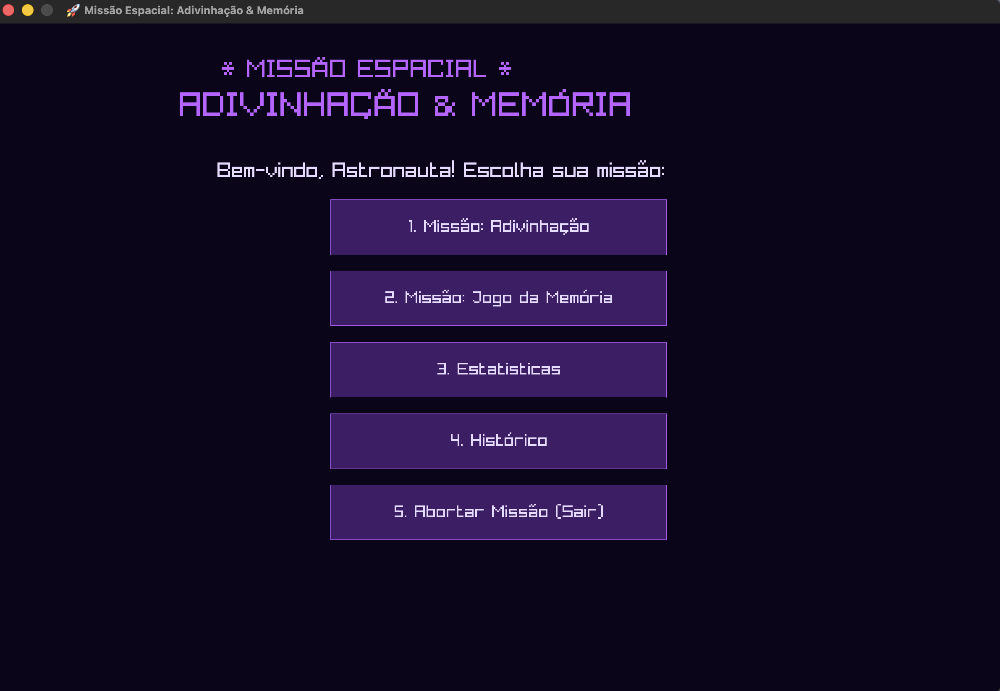
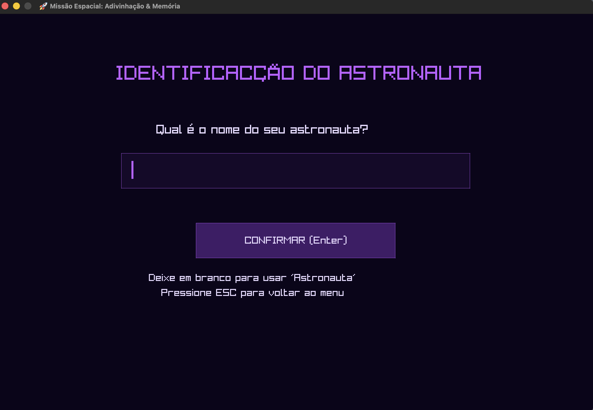
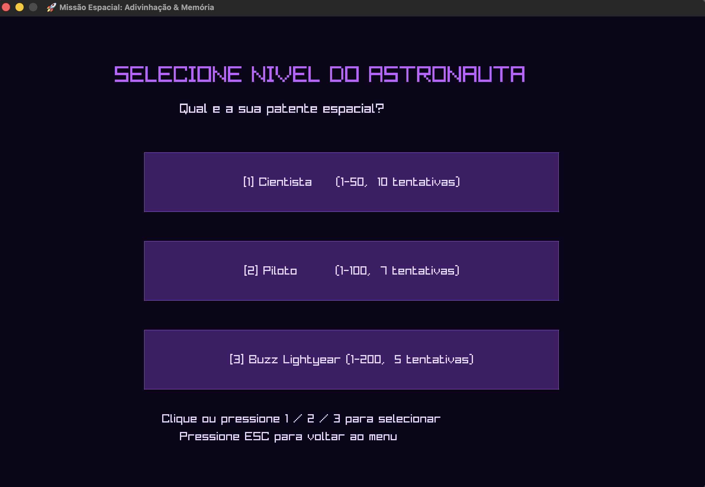
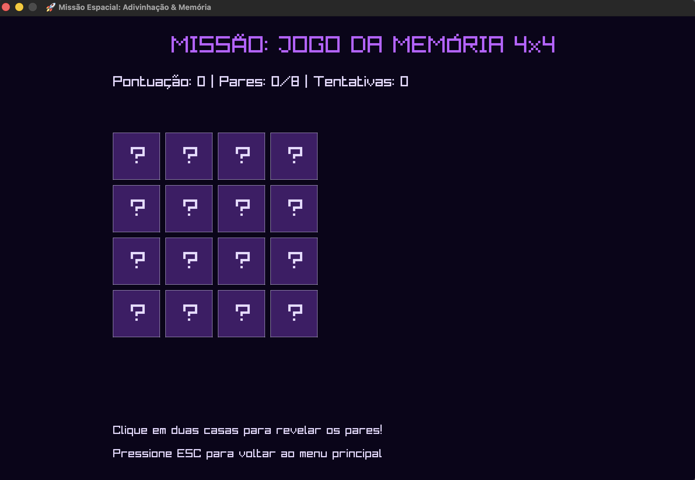
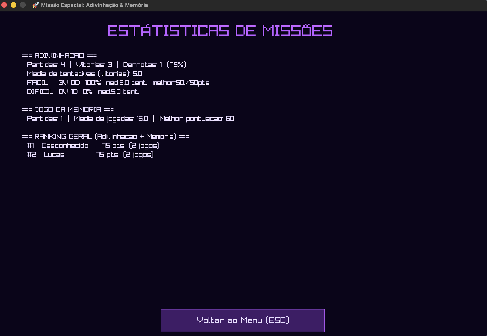
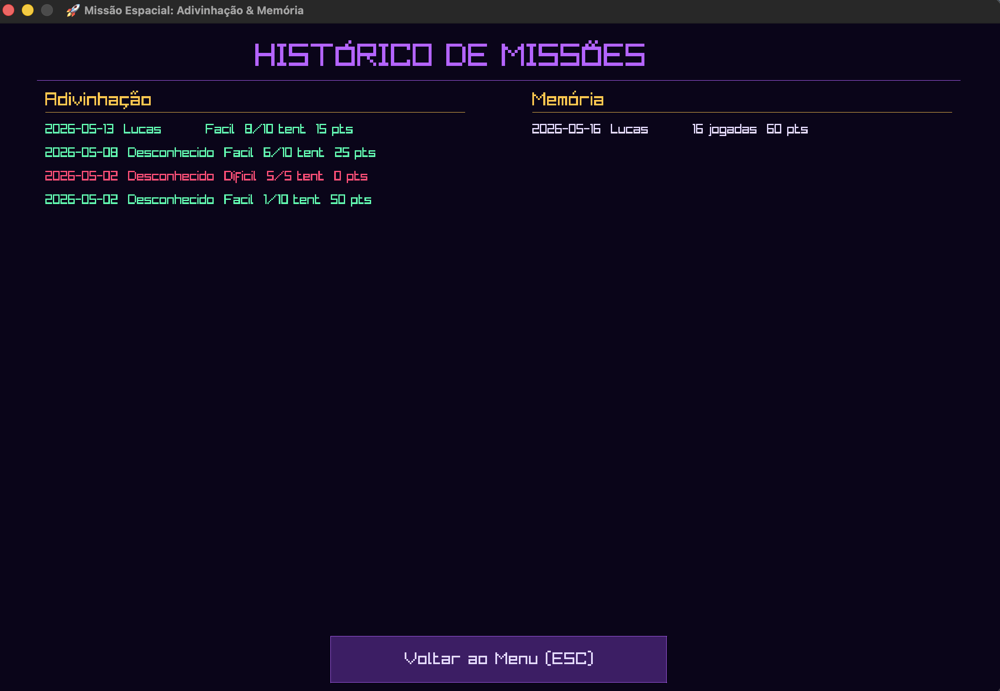

<h1 align="center"> Jogo da Adivinhação Otimizado em C
<br>


[](https://github.com/viictorpaes/Jogo-da-Adivinhacao/blob/main/LICENSE)
[](https://github.com/viictorpaes/Jogo-da-Adivinhacao/actions)

</h1>


<h2 align="center">👥👨🏻‍🏫 Docentes Responsáveis: </h2>
<ul>
  <li><strong>Aêda Monalliza Cunha de Sousa</strong> <a href="https://www.linkedin.com/in/aedasousa/" target="_blank"></a></li>
  <li><strong>Guilherme Fernando Cacalvanti Pereira</strong> <a href="https://www.linkedin.com/in/guilherme-pereira-11a32511a" target="_blank"></a></li>
  <li><strong>Lucas Rodolfo Celestino de Farias</strong><a href="https://www.linkedin.com/in/fariaslrc" target="_blank"> </a></li>
  <li><strong>Renan Costa Alencar</strong><a href="https://www.linkedin.com/in/renancostaalencar" target="_blank"> </a></li>
  <li><strong>Ricardo Macedo Baudel</strong><a href="https://www.linkedin.com/in/ricardo-baudel-700a98127/" target="_blank"> </a></li>
</ul>


<h2 align="center">👤👨‍🎓 Integrantes do Projeto: </h2>
<ul>
<li><b>Lucas Paguetti Pereira (Líder 👑)</b> <a href="https://www.linkedin.com/in/lucas-paguetti-pereira" target="_blank"></a> <a href="https://github.com/wqiluc" target="_blank"></a></li>
<li>Eduardo de Souza Cavalcanti Junior <a href="https://www.linkedin.com/in/eduardoscavalcantij/" target="_blank"></a> <a href="https://github.com/eduardo-scavalcanti" target="_blank"></a></li>
<li>Felipe Franca Alves de Lima <a href="https://www.linkedin.com/in/felipefrancaal/" target="_blank"></a> <a href="https://github.com/ffrancaal" target="_blank"></a></li>
<li>Helamã Leone de Lima Procídio <a href="https://www.linkedin.com/in/helam%C3%A3-procidio-428772367/" target="_blank"></a> <a href="https://github.com/procidiohelama-star" target="_blank"></a></li>
<li>João Pedro Arruda Guimarães <a href="https://www.linkedin.com/in/jo%C3%A3o-pedro-arruda-guimar%C3%A3es-157952287/" target="_blank"></a> <a href="https://github.com/Jp230603" target="_blank"></a></li>
<li>Tiago Luiz Moreira de Vasconcelos <a href="https://www.linkedin.com/in/tiagoluiz23/" target="_blank"></a> <a href="https://github.com/tlmv23" target="_blank"></a></li>
<li>Victor José Paes e Silva <a href="https://www.linkedin.com/in/viictorpaes/" target="_blank"></a> <a href="https://github.com/viictorpaes" target="_blank"></a></li>
</ul>


<h2 align="center"> ⛏️💻 Tecnologias Utilizadas: </h2>
<p align="center">
   <br>
  
  
  
  
  
  
  
   <br>
  
  
   <br>
  
  
  
</p>

<h2 align="center"><b>🛠️ Especificações Técnicas</b></h2>

<b>O projeto foi desenvolvido focando em modularização e boas práticas de programação em C:</b>

* **Modularização:** Divisão do código em arquivos `.h` (cabeçalhos) e `.c` (implementação) para facilitar a manutenção e organização lógica (Game, Utils, History, Stats).
* **Gerenciamento de Memória:** Uso de estruturas de dados eficientes para manipulação de ranking e histórico sem vazamento de memória.
* **Manipulação de Arquivos:** Persistência de dados em formato CSV/TXT, garantindo que o progresso do jogador não seja perdido ao fechar o terminal.
* **Algoritmo de Aleatoriedade:** Utilização da biblioteca `time.h` para garantir sementes de números aleatórios únicas a cada execução.

<br>

## 🚀 Como Executar o Projeto:

### Pré-requisitos

* **Compilador GCC**  
* **Git (Versionamento)**  
* **Padrão da Linguagem C**  
* **Raylib**  — necessário apenas para a versão gráfica (`make raylib`)


<h2 align="center">💻Instalação do Raylib<br>
</h2>

<h3>

</h3>

```bash
brew install raylib
```

<h3>

</h3>

```bash
sudo apt-get install libraylib-dev
```

<h3>
 MSYS2 / MinGW
</h3>

```bash
pacman -S mingw-w64-x86_64-raylib
```


> [!TIP]
> No Windows, baixe os binários pré-compilados em [raylib.com/download](https://www.raylib.com/index.html) e adicione ao PATH, ou use o MSYS2: `pacman -S mingw-w64-x86_64-raylib`.

---

Após baixar o Github desktop: <br>


2. **Clone o repositório:**
   ```bash
   git clone https://github.com/viictorpaes/Jogo-da-Adivinhacao
   ```

4. **Abra sua IDE de escolha:** <br>   
  
5. **Siga os seguintes comandos 🕹️** <br>
   <ul>
  <li>
  Windows  <br>
    <code>Ctrl</code> + <code>j</code> (tecla de crase)
  </li> <br>
  <li>
     <br>
    <code>Ctrl</code> + <code>j</code> (tecla de crase)
  </li> <br>
  <li>
     <br>
    <code>Command</code> + <code>j</code> (tecla de crase)
  </li>
</ul> 

<br>

5. *No terminal Integrado:* <br>


<h3 align="left">🖥️ Terminal (Console) <br>
</h3>

| Comando | Descrição |
| :--- | :--- |
| `make` | Compila a versão terminal |
| `make run` | Compila e executa a versão terminal |
| `make DEBUG=1` | Compila com símbolos de debug (`-g -O0`) |

<h3 align="left">🎨 Visual (RayLib) <br>
</h2>

| Comando | Descrição |
| :--- | :--- |
| `make build-raylib` | Compila a versão visual sem executar |
| `make raylib` | Compila e executa a versão visual |

#### 🛠️ Utilitários

| Comando | Descrição |
| :--- | :--- |
| `make clean` | Remove binários compilados |
| `make format` | Formata o código com clang-format |
| `make help` | Lista todos os alvos disponíveis |

### 🎮🟢🟡🔴 Níveis de Dificuldade

A dificuldade selecionada altera o intervalo de números possíveis e restringe o número de tentativas, recompensando a precisão com pontuações maiores.

| Nível | Intervalo | Tentativas | Pontuação Base | Desafio |
| :--- | :---: | :---: | :---: | :--- |
| **Fácil** | `1 a 50` | 10 | 1000 | 🟢 Baixo |
| **Médio** | `1 a 100` | 7 | 2000 | 🟡 Moderado |
| **Difícil** | `1 a 200` | 5 | 5000 | 🔴 Alto |

### 📡🚀🌌🔭 Sistema de Feedback Espacial

Para tornar a jogabilidade mais imersiva, o jogo utiliza um sistema de proximidade baseado na estabilidade do sinal em órbita. O feedback é calculado pela diferença absoluta ($|palpite - secreto|$):

| Feedback | Condição (Distância) | Descrição |
| :--- | :--- | :--- |
| **Sinal estabelecido! Resgate a caminho!** 📡 | $\pm 1$ | Você está a apenas uma unidade do número! |
| **Frequência muito próxima!** 🔭 | $\leq 5$ | Você está muito perto, o acerto é iminente. |
| **Sinal detectado!** 📶 | $\leq 15$ | Você está na vizinhança correta do número. |
| **Interferência estática...** 🌌 | $> 15$ | Você ainda está longe do objetivo. |

> [!IMPORTANT]
> Além da temperatura, o jogo continuará informando se o número secreto é **maior** ou **menor** que o palpite, auxiliando na estratégia de busca do jogador.

### 💎 Por que o C11 é fundamental neste projeto?

Diferente de versões legadas (como C89/C90), o C11 introduz recursos que garantem que o jogo seja robusto e pronto para sistemas modernos:

| Recurso ⛏️| Benefício para o Projeto ✅ |
| :--- | :--- |
| **Segurança de Memória** | Substituição de funções perigosas (como `gets`) por alternativas que evitam *Buffer Overflow*. |
| **Macros Genéricas (`_Generic`)** | Permite que funções utilitárias lidem com diferentes tipos de dados de forma mais inteligente. |
| **Alinhamento de Dados** | Otimização do uso de memória e cache, tornando o processamento de estatísticas mais rápido. |
| **Tipagem Estrita** | Garante que o histórico de partidas gravado no disco seja lido sem corrupção de tipos. |

### 🏗️ Modularizção e Boas Práticas

* **Modularização (Encapsulamento):** O código é dividido em camadas lógicas. O módulo `game/` não precisa saber como o módulo `history/` grava os arquivos; ele apenas consome a interface (API) definida no `.h`.
* **Gerenciamento de Fluxo:** Uso de estruturas de controle otimizadas para o loop de adivinhação, garantindo baixa latência de resposta no terminal.
* **Persistência de Dados:** Implementação de manipulação de arquivos (I/O) com tratamento de erros rigoroso, prevenindo perda de dados caso o programa seja interrompido abruptamente.
* **Portabilidade:** O código é compatível com compiladores GCC, Clang e MSVC, podendo ser compilado em ambientes Linux, Windows ou macOS sem alterações no núcleo da lógica.


| Flag de Compilação ⚙️ | Impacto no Desenvolvimento 🚀 |
| :--- | :--- |
| **Standard C11 (`-std=c11`)** | Habilita recursos modernos da revisão de 2011 e garante portabilidade do código. |
| **All Warnings (`-Wall`)** | Ativa alertas sobre os erros mais comuns, como variáveis declaradas e não utilizadas. |
| **Extra Warnings (`-Wextra`)** | Habilita verificações rigorosas de lógica que o padrão `-Wall` pode acabar ignorando. |
| **Optimization (`-O2`)** | Otimiza o código para uma execução mais veloz sem comprometer o tamanho do binário. |
| **Strict Mode (`-Werror`)** | Trata avisos como erros fatais, impedindo a compilação de códigos considerados "sujos". |
| **Debug Mode (`-g`)** | Inclui símbolos de depuração essenciais para o uso de ferramentas como GDB ou Valgrind. |


| Pilar de Qualidade 🏗️ | Objetivo Técnico ✅ |
| :--- | :--- |
| **Modularização** | Divisão em arquivos `.h` e `.c`, facilitando a manutenção e a organização das funções. |
| **Segurança de I/O** | Uso de `fgets()` e `strncmp()` para proteger contra *Buffer Overflow* e falhas de leitura. |
| **Gestão de Memória** | Gerenciamento dinâmico consciente para evitar vazamentos (*Memory Leaks*) no ranking. |
| **Tratamento de Erros** | Verificação de `fopen()` para evitar que o programa feche se o arquivo de dados sumir. |
| **Legibilidade** | Uso de nomes de variáveis claros para que a lógica seja entendida sem esforço extra. |


> [!NOTE]
> **Potencialize seu Workflow:** Instale a extensão oficial [**Makefile Tools**](https://marketplace.visualstudio.com/items?itemName=ms-vscode.makefile-tools) da Microsoft no seu VS Code. 
> 
> Ela adiciona botões de **"Play"** e **"Debug"** na sua barra de status que leem automaticamente as regras de compilação do projeto, facilitando o gerenciamento da nossa arquitetura modular sem a necessidade de comandos manuais no terminal (se preferir).
>
> 


> [!IMPORTANT]
> **Padronização e Qualidade de Código:** Automatize a estética técnica do projeto.
> 
> A presença dos arquivos **`.clang-format`** e **`.prettierrc`** na raiz do repositório garante que a formatação do código seja tratada como infraestrutura, não como preferência pessoal. Isso elimina ruídos em *Code Reviews* e assegura que 100% da base de código mantenha uma identidade visual única e profissional.
>
>  

---

### 🛠️ O papel de cada ferramenta

* **`.clang-format` (C/C++):** Gerencia a complexidade sintática de linguagens de baixo nível. Define o alinhamento de ponteiros, quebras de macros e indentação de *namespaces*, seguindo padrões rigorosos (LLVM/Google).
* **`.prettierrc` (Web & Config):** Atua em arquivos de configuração (JSON, YAML) e documentação (Markdown). Sua filosofia "opinativa" garante que o layout do código seja previsível e extremamente legível.

### 🚀 Por que isso é indispensável?

| Benefício | Descrição |
| :--- | :--- |
| **Diffs Semânticos** | Alterações no Git mostram apenas mudanças de lógica, sem "lixo" visual de espaços ou tabs. |
| **Zero Atrito** | Novos desenvolvedores performam imediatamente sem precisar estudar guias de estilo manuais. |
| **Manutenibilidade Eficiente** | Código padronizado é mais rápido de ler, diagnosticar, corrigir e debugar. |

> Instale as extensões oficiais [**Prettier - Code formatter**](https://marketplace.visualstudio.com/items?itemName=esbenp.prettier-vscode) e [**C/C++**](https://marketplace.visualstudio.com/items?itemName=ms-vscode.cpptools) da Microsoft no seu VS Code para habilitar o suporte total aos arquivos de configuração.
>

<h2 align="center">🏰 Arquitetura do Projeto <br>
</h2>
<pre>
Jogo-da-Adivinhacao/
├── .gitignore 
├── .clang-format 
├── .prettierrc 
├── Makefile 
├── protótipo.fig 
├── README.md 
├── LICENSE 
├── docs /
│   ├── API.md 
│   ├── ARCHITECTURE.md 
│   ├── CONTRIBUTING.md 
│   ├── FRONTEND_RAYLIB.md 
│   ├── Histórias_de_Usuário.md 
│   ├── MEMORIA.md 
│   ├── schema.md 
│   └── SECURITY.md 
├── img /
├── data /
│   ├── historico.csv 
│   ├── historico.txt 
│   ├── historico_memoria.csv 
│   └── historico_memoria.txt 
└── src src-111827?style=flat-square&logo=visualstudiocode&logoColor=007ACC" height="18"/>/
    ├── main.c 
    ├── main_raylib.c 
    ├── game /
    │   ├── jogo.c 
    │   ├── jogo.h 
    │   ├── memorygame.c  
    │   ├── memorygame.h 
    │   ├── jogar_memoria.c  
    │   └── jogar_memoria.h 
    ├── ui /
    │   ├── menu.c  
    │   ├── menu.h 
    │   ├── frontend.c  
    │   └── frontend.h 
    ├── ux /
    │   ├── acessibilidade.md 
    │   ├── jogar.md 
    │   ├── jornadas.md 
    │   └── personas.md  
    ├── history /
    │   ├── historico.c 
    │   └── historico.h 
    ├── utils /
    │   ├── utils.c 
    │   └── utils.h 
    ├── static/
    │   ├── estatisticas.c 
    │   └── estatisticas.h 
    └── include /
        └── tipos.h 
</pre>


<h3 align="center"> 🚀 Backlog e Boarding (Trello) </h3>
<p align="center">
  <strong>Status:</strong> 20 histórias de usuário implementadas e 16 futuras, definidas seguindo o padrão 3Cs e priorizadas no backlog.
</p>


<p align="center">
  <strong>Acesse o Board do projeto e o documento completo de HUs</strong>: <br>
  <a href="https://trello.com/b/yp8S6Ek9/jogo-de-adivinhacao-projetos-2-pif-fds" target="_blank">
    
  </a>
  <a href="./docs/Histórias_de_Usuário.md" target="_blank">
    
  </a>
</p>

<h3 align="center">🎨 Diagramas, Protótipos e Validação de UX</h3>
<p align="center">
  <strong>Demonstração do Protótipo (Screencast):</strong> <br>
  <a href="https://www.youtube.com/watch?v=OtLZ7gIEQFQ" target="_blank">
    
  </a>
  <a href="https://www.figma.com/pt-br/comunidade/file/1623063562663924122/cesarnumber-v1" target="_blank">
    
  </a>
</p>


<h2 align="center">Telas 📱</h2>

<table align="center" width="780">
  <tr><th align="center">🏠 Tela Inicial</th></tr>
  <tr><td align="center"><b>Menu principal do jogo — o jogador escolhe entre os modos disponíveis: Adivinhação, Memória e acesso ao Histórico/Estatísticas.</b></td></tr>
  <tr><td align="center"></td></tr>
</table>

<br>

<table align="center" width="780">
  <tr><th align="center">✏️ Salvar Nome</th></tr>
  <tr><td align="center"><b>Tela de cadastro do astronauta — o jogador insere seu nome antes de iniciar a partida para que o resultado seja salvo no ranking.</b></td></tr>
  <tr><td align="center"></td></tr>
</table>

<br>

<table align="center" width="780">
  <tr><th align="center">🔭 Jogo de Adivinhação</th></tr>
  <tr><td align="center"><b>Modo single-player de adivinhação — sintonize a frequência de resgate correta dentro do número de tentativas disponíveis, com feedback espacial em tempo real.</b></td></tr>
  <tr><td align="center"></td></tr>
</table>

<br>

<table align="center" width="780">
  <tr><th align="center">🧠 Jogo de Memória</th></tr>
  <tr><td align="center"><b>Modo single-player de memória — encontre os pares de coordenadas estelares no grid. Quanto menos tentativas, maior a pontuação.</b></td></tr>
  <tr><td align="center"></td></tr>
</table>

<br>

<table align="center" width="780">
  <tr><th align="center">📊 Estatísticas</th></tr>
  <tr><td align="center"><b>Painel de desempenho — exibe médias de tentativas, melhor e pior sessão, e outros dados calculados a partir do histórico de partidas.</b></td></tr>
  <tr><td align="center"></td></tr>
</table>

<br>

<table align="center" width="780">
  <tr><th align="center">📜 Histórico</th></tr>
  <tr><td align="center"><b>Registro completo de todas as sessões jogadas — mostra data, nome do jogador, dificuldade, tentativas utilizadas e resultado de cada partida.</b></td></tr>
  <tr><td align="center"></td></tr>
</table>

<h2 align="center"> LICENSE <br>
<a href="LICENSE"></a>
</h2>

```license
MIT License

Copyright (c) 2026, Lucas Paguetti Pereira, Eduardo de Souza Cavalcanti Junior,
Felipe Franca Alves de Lima, Helamã Leone de Lima Procídio,
João Pedro Arruda Guimarães, Tiago Luiz Moreira de Vasconcelos,
Victor José Paes e Silva

Permission is hereby granted, free of charge, to any person obtaining a copy
of this software and associated documentation files (the "Software"), to deal
in the Software without restriction, including without limitation the rights
to use, copy, modify, merge, publish, distribute, sublicense, and/or sell
copies of the Software, and to permit persons to whom the Software is
furnished to do so, subject to the following conditions:

The above copyright notice and this permission notice shall be included in all
copies or substantial portions of the Software.

THE SOFTWARE IS PROVIDED "AS IS", WITHOUT WARRANTY OF ANY KIND, EXPRESS OR
IMPLIED, INCLUDING BUT NOT LIMITED TO THE WARRANTIES OF MERCHANTABILITY,
FITNESS FOR A PARTICULAR PURPOSE AND NONINFRINGEMENT. IN NO EVENT SHALL THE
AUTHORS OR COPYRIGHT HOLDERS BE LIABLE FOR ANY CLAIM, DAMAGES OR OTHER
LIABILITY, WHETHER IN AN ACTION OF CONTRACT, TORT OR OTHERWISE, ARISING FROM,
OUT OF OR IN CONNECTION WITH THE SOFTWARE OR THE USE OR OTHER DEALINGS IN THE
SOFTWARE.
```