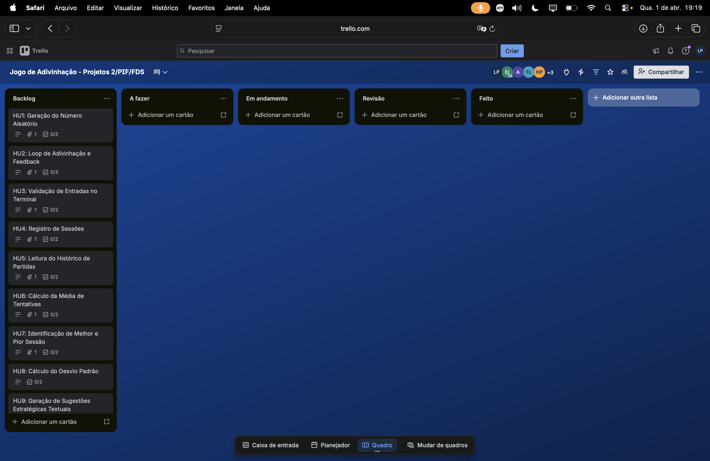
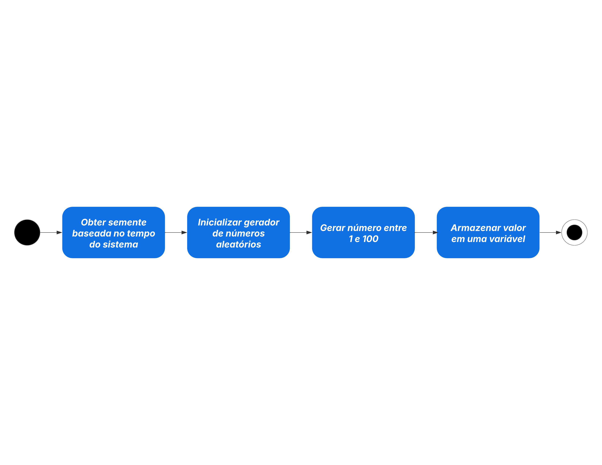
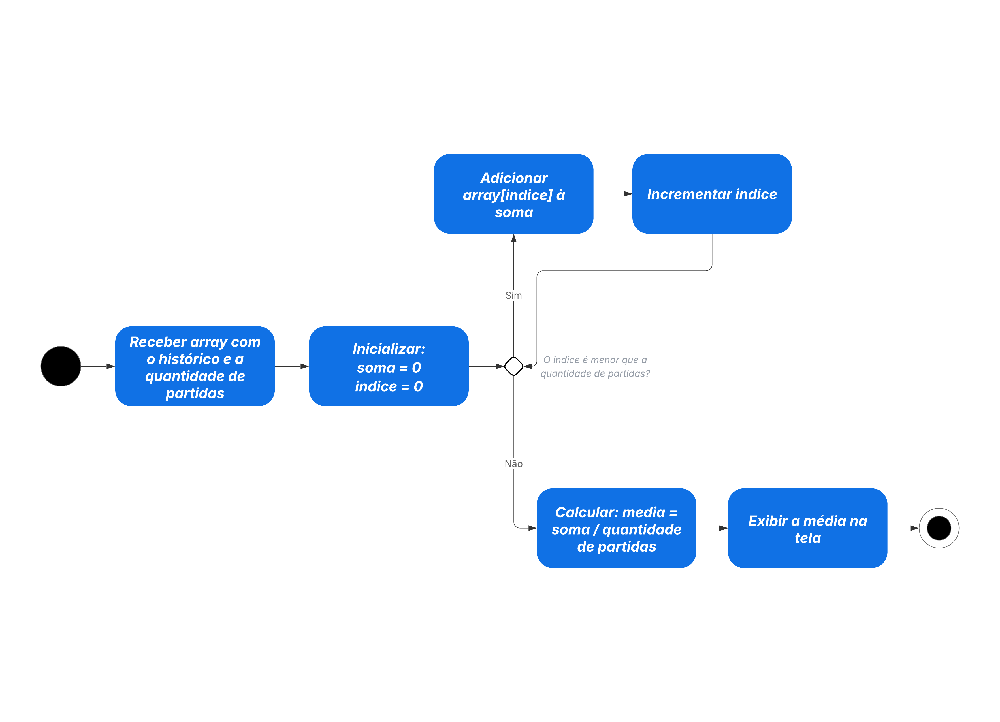

<h1 align="center">
Jogo de Adivinhação Otimizado em C  
 

</h1>

<h2 align="center">👥👨🏻‍🏫 Docentes Responsáveis: </h2>

<ul>
  <li><strong>Aêda Monalliza Cunha de Sousa</strong> </li>
  <li><strong>Lucas Rodolfo Celestino de Farias</strong>
  <li><strong>Renan Costa Alencar</strong>

</ul> 
 
<h2 align="center">👤👨‍🎓 Integrantes do Projeto: </h2>
<ul>
<li>Eduardo de Souza Cavalcanti Junior  </li>
<li>Felipe Franca Alves de Lima  </li>
<li>Helamã Leone de Lima Procídio  </li>
<li>João Pedro Arruda Guimarães  </li>
<li>Lucas Paguetti Pereira  </li>
<li>Tiago Luiz Moreira de Vasconcelos  </li>
<li>Victor José Paes  </li>
</ul>

<h2 align="center"> 🔨💻 Tecnologias Utilizadas: </h2>

  
  
  
  
  

🛠️ Especificações Técnicas:
...

<h2 align="center">🏰 Arquitetura do Projeto: </h2>
<pre>
Jogo-da-Adivinhacao/
├── README.md 
├── img/ 
├── dados/ 
│   └── historico.txt 
├── src/ 
│   ├── jogo/ 
│   │   ├── jogo.c 
│   │   └── jogo.h 
│   ├── util/ 
│   │   ├── util.c 
│   │   └── util.h 
│   ├── historico/ 
│   │   ├── historico.c 
│   │   └── historico.h 
│   ├── analise/ 
│   │   ├── analise.c 
│   │   └── analise.h 
│   ├── tipos/ 
│   │   └── tipos.h 
│   └── main.c 
</pre>

<h2 align="center"> Backlog/Quadro do Projeto:  
  
<h2 align="center"> Diagramas de Atividades do Sistema</h2>

  <strong>Representações visuais dos fluxos de cada funcionalidade, organizadas por histórias de usuário e integradas à documentação do projeto.</strong>

  Acessíveis também nos cards do <mark>Trello</mark>:  
  

<h3 align="center"><strong>HU1 - Geração de Número Aleatório</strong></h3>

  Responsável por criar o número secreto que será utilizado durante a partida, garantindo aleatoriedade a cada execução.

  

<h3 align="center"><strong>HU2 - Loop de Adivinhação e Feedback</strong></h3>

  Controla o fluxo principal do jogo, permitindo múltiplas tentativas e fornecendo respostas ao usuário indicando se o palpite está alto, baixo ou correto.

  

<h3 align="center"><strong>HU3 - Validação de Entradas no Terminal</strong></h3>

  Garante que os dados inseridos pelo usuário sejam válidos, evitando erros e assegurando que apenas valores permitidos sejam processados.

  

<h3 align="center"><strong>HU4 - Registro de Sessões</strong></h3>

  Armazena informações de cada partida realizada, possibilitando o acompanhamento do desempenho ao longo do tempo.

  

<h3 align="center"><strong>HU5 - Leitura do Histórico de Partidas</strong></h3>

  Permite acessar e visualizar dados previamente registrados, oferecendo uma visão geral das partidas anteriores.

  

<h3 align="center"><strong>HU6 - Cálculo da Média de Tentativas</strong></h3>

  Realiza o processamento dos dados coletados para calcular a média de tentativas realizadas nas partidas.

  

<h3 align="center"><strong>HU7 - Identificação de Melhor e Pior Sessão</strong></h3>

  Analisa os resultados registrados para destacar o melhor e o pior desempenho entre as sessões jogadas.

  

