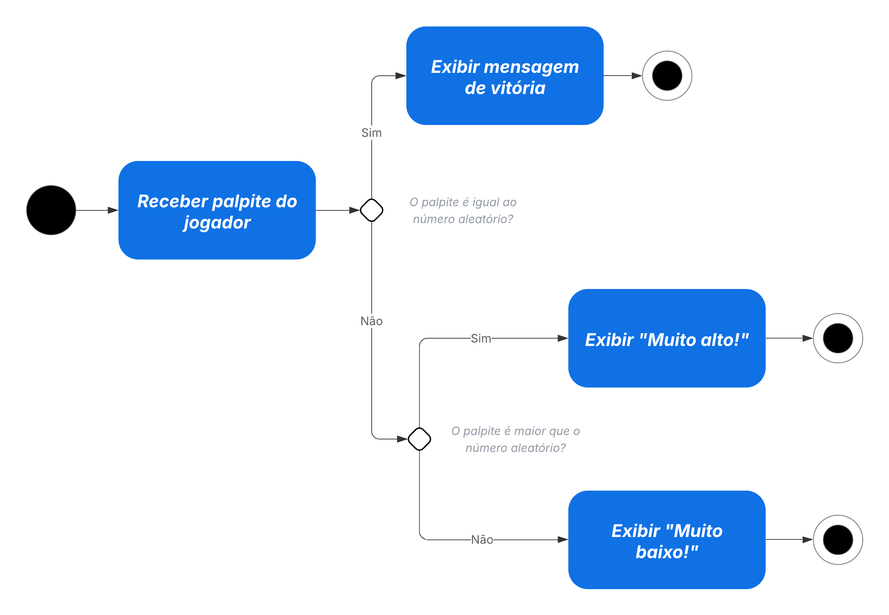
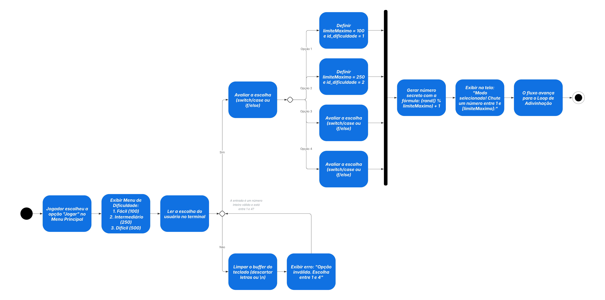

<h1 align="center"> 🎮 Modos de Jogo<br>
</h1>

<p align="center">Descrição completa de cada modo de jogo disponível nas versões <b>Console</b> e <b>Raylib</b>.</p>

<p align="center">
  
  
  
  
</p>


## 🗺️ Visão Geral

O projeto implementa **6 modos de jogo** agrupados em dois eixos:

| Eixo | Modos |
| :--- | :--- |
| 🧍 **Solo** | Adivinhação, Memória, Protocolo Lógico, Precedência de Operadores |
| ⚔️ **Versus (1v1)** | Adivinhação VS, Memória VS |

Todos os modos estão disponíveis nas duas interfaces:

| 🎮 Modo | 🖥️ Console (`make run`) <br>  | 🪟 Raylib (`make raylib`) <br>  |
| :--- | :---: | :---: |
| 🔢 Adivinhação Solo | ✅ | ✅ — **Operação Resgate** |
| ⚔️ Adivinhação VS | ✅ | ✅ — **Batalha de Sinais** |
| 🧠 Memória Solo | ✅ | ✅ — **Mapas Estelares** |
| 🤝 Memória VS | ✅ | ✅ — **1v1 Mapas Estelares** |
| 🔬 Protocolo Lógico | ✅ | ✅ — **Protocolo Lógico** |
| 🧮 Precedência de Operadores | ✅ | ✅ — **Hierarquia de Comandos** |

### 🚀 Menu Principal (Raylib)


## 1. 🔢 Adivinhação Solo

 

O jogador tenta descobrir um número inteiro gerado aleatoriamente dentro de um intervalo definido pela dificuldade. Após cada palpite o jogo retorna uma dica direcional: **⬆️ MAIOR**, **⬇️ MENOR** ou **✅ ACERTOU**.

### ⚙️ Mecânica

| Etapa | Descrição |
| :--- | :--- |
| 🎲 **Sorteio** | Número secreto gerado com `rand()` no intervalo da dificuldade escolhida |
| 💬 **Palpite** | Jogador digita um inteiro; `processar_palpite` compara e retorna a dica |
| 🏁 **Fim** | Acertou ou esgotou as tentativas → `partida_encerrada` retorna `true` |

**🎲 Geração do número secreto:**


**🔄 Loop de palpite e feedback:**



### 🏅 Dificuldades

| 🎖️ Nível | 📏 Intervalo | ❤️ Tentativas máx. |
| :--- | :---: | :---: |
| 🟢 Fácil | 1 – 10 | 10 |
| 🟡 Médio | 1 – 50 | 8 |
| 🔴 Difícil | 1 – 100 | 5 |

**🔀 Fluxo de seleção de dificuldade (Console):**



#### 🪖 Seleção de Dificuldade — Raylib (Operação Resgate)


### 🕹️ Como Jogar

1. 🎖️ Selecione a dificuldade no menu.
2. ⌨️ Digite um número inteiro a cada rodada.
3. 🔍 Siga as dicas (⬆️ MAIOR / ⬇️ MENOR) até acertar ou esgotar as tentativas.

#### 💻 Exemplo de Sessão (Console)

```bash
$ make run

 Bem-vindo ao Jogo da Adivinhação!
 Digite seu nome: Astronauta

 Selecione a dificuldade:
  [1] 🟢 Fácil   (1-10,  5 tentativas)
  [2] 🟡 Médio   (1-50,  8 tentativas)
  [3] 🔴 Difícil (1-100, 10 tentativas)
 Escolha: 2

 Número sorteado entre 1 e 50. Boa sorte! 🍀

 Tentativa 1/8 → Seu palpite: 25
 ⬆️ MAIOR! O número é maior que 25.

 Tentativa 2/8 → Seu palpite: 37
 ⬇️ MENOR! O número é menor que 37.

 Tentativa 3/8 → Seu palpite: 31
 ✅ ACERTOU! O número era 31! 🎉
 Pontuação: 85 pontos  |  Tentativas usadas: 3/8
```

#### 🪐 Identificação e Entrada — Raylib


### 📊 Pontuação e Persistência

- 🏆 Pontos calculados em `static/estatisticas.c` com base nas tentativas restantes e na dificuldade.
- ⏱️ Na versão Raylib há um timer de **15 s** por tentativa; o tempo restante contribui para o bônus de pontos.
- 💾 Histórico salvo em `data/historico.csv` e `data/historico.txt`.

### 📁 Módulos Relevantes

| 📄 Arquivo | 🔧 Papel |
| :--- | :--- |
| `src/game/jogo.c` | Sorteio, `processar_palpite`, `partida_encerrada`, `exibir_resultado_final` |
| `src/static/estatisticas.c` | `calcular_pontos`, heurísticas de feedback |
| `src/history/historico.c` | Salva `RegistroPartida` no CSV e TXT |


## 2. ⚔️ Adivinhação VS (1v1)

 

Dois jogadores disputam o mesmo número secreto em turnos alternados. Vence quem acertar primeiro em cada rodada. A partida dura **3 rodadas** e cada jogador tem **12 tentativas por rodada**.

### ⚙️ Mecânica

| Etapa | Descrição |
| :--- | :--- |
| 🎲 **Início** | Um único número secreto é sorteado por rodada |
| 🔄 **Turnos** | Jogadores alternam; quem acertar primeiro ganha a rodada |
| ⏳ **Limite** | Se nenhum acertar em 12 tentativas, a rodada é empate 🤝 |
| 🏆 **Fim** | Após 3 rodadas, quem acumulou mais vitórias vence a partida |

### 🕹️ Como Jogar

1. 👤 Informe os nomes dos dois jogadores.
2. 🎖️ Escolha a dificuldade (mesmos intervalos da versão Solo).
3. 🔄 Os jogadores se alternam — o que acertar primeiro ganha a rodada.
4. 🏆 Ao final das 3 rodadas, o placar de vitórias decide o vencedor.

#### 💻 Exemplo de Turno (Console)

```bash
 ⚔️ === BATALHA DE SINAIS — 1v1 ===
 Rodada 1/3  |  Astr. 1: 0 vitória(s)  |  Astr. 2: 0 vitória(s)

 🎯 TURNO DE: Astronauta  (Tent. 1/12)
 Range Cadete: 1 a 10
 Seu palpite: 5
 ⬆️ MAIOR!

 🎯 TURNO DE: Astronauta 2  (Tent. 1/12)
 Seu palpite: 8
 ⬇️ MENOR!

 🎯 TURNO DE: Astronauta  (Tent. 2/12)
 Seu palpite: 7
 ✅ Astronauta ACERTOU! Ganha a rodada 1! 🏆
```

#### 🪟 Gameplay — Raylib (Batalha de Sinais)


#### 🪐 Identificação dos Jogadores — Raylib


### 📊 Pontuação e Persistência

- 🏅 Vitórias e pontos acumulados por rodada para cada jogador.
- 💾 Histórico salvo em `data/historico_vs.csv` e `data/historico_vs.txt`.

### 📁 Módulos Relevantes

| 📄 Arquivo | 🔧 Papel |
| :--- | :--- |
| `src/game/jogos_extras.c` | `jogar_adivinhacao_vs` — orquestra turnos e placar |
| `src/game/jogo.c` | `iniciar_partida`, `processar_palpite` (reutilizados) |
| `src/history/historico.c` | Salva `RegistroVS` no CSV e TXT |


## 3. 🧠 Jogo da Memória Solo

  

Tabuleiro **4×4** com 16 casas que escondem 8 pares de números (1 a 8). O jogador revela duas casas por turno; se formarem par, ficam abertas permanentemente. O objetivo é encontrar todos os 8 pares no menor número de tentativas. 🃏

### ⚙️ Mecânica

| Etapa | Descrição |
| :--- | :--- |
| 🔀 **Embaralhamento** | 16 números (pares 1–8) distribuídos com **Fisher-Yates** a cada partida |
| 👆 **Escolha** | O jogador seleciona duas casas por rodada (posições 1–16) |
| 👁️ **Revelação** | As duas casas são exibidas temporariamente |
| ✔️ **Verificação** | Par correto → casas marcadas como `acertadas`; par errado → voltam a ficar ocultas |
| 🏁 **Fim** | Todos os 8 pares encontrados → `jogo_memoria_finalizado` retorna `true` |

### 🗂️ Estrutura de Dados

```c
typedef struct
{
    int  numeros[16]; // Números do tabuleiro (1-8, duplicados)
    bool reveladas[16]; // Estado de cada casa (visível ou oculta)
    bool acertadas[16]; // Pares já confirmados
    int pontuacao; // Pontuação acumulada
    int tentativas; // Total de tentativas realizadas
    int pares_encontrados; // Pares acertados até o momento
} JogoMemoria;
```

### 🔧 Funções Principais

| ⚙️ Função | 📝 Descrição |
| :--- | :--- |
| `inicializar_jogo_memoria()` | Cria novo jogo com tabuleiro embaralhado e contadores zerados |
| `exibir_tabuleiro(const JogoMemoria *)` | Imprime o estado atual do tabuleiro no terminal |
| `fazer_jogada(JogoMemoria *, int pos1, int pos2)` | Processa as duas casas escolhidas; retorna `true` se acertou o par |
| `jogo_memoria_finalizado(const JogoMemoria *)` | Retorna `true` quando todos os 8 pares foram encontrados |
| `exibir_resultado_memoria(const JogoMemoria *)` | Exibe pontuação, tentativas e eficiência ao fim da partida |
| `jogar_memoria()` | Executa o loop completo de turnos no console |

### 🏆 Sistema de Pontuação

| Evento | Pontos |
| :--- | :---: |
| ✅ Acerto de par | `+10` |
| ❌ Par errado | `0` |

Ao final são exibidas: 🏆 pontuação total, 🃏 pares encontrados, 🔢 tentativas realizadas e 📈 eficiência (acertos/tentativas).

### 🕹️ Como Jogar (Console)

1. 📋 Selecione a opção **[2] Jogar Memória** no menu principal.
2. 👁️ O tabuleiro exibe 16 casas numeradas, todas ocultas (`?`).
3. ⌨️ Digite o número de duas casas que deseja revelar.
4. ✅ Par correto → `✅` permanece; par errado → casas voltam a `?`.
5. 🏁 Continue até encontrar todos os **8 pares**.

#### 🖥️ Exemplo de Tabuleiro (Console)

```
╔════════════════════════════════╗
║   🧠 JOGO DA MEMÓRIA 4x4 🧠   ║
║  Pontuação: 20 | Pares: 2/8  ║
╚════════════════════════════════╝

      [1]    [2]    [3]    [4]
[1]    ?      ?      ?      ?
[2]    ✅     ?      ?      ?
[3]    ?      ?      ✅     ?
[4]    ?      ?      ?      ?
```

#### 💻 Exemplo de Jogada (Console)

```bash
Escolha as duas casas (1-16):
Primeira casa: 3
Segunda casa: 11

Casa 3 revelou: 5
Casa 11 revelou: 5

✅ Acertou! 5 = 5  →  +10 pontos! 🎉 Total: 30
```

#### 🪟 Gameplay — Raylib (Mapas Estelares)


> 🖱️ No Raylib, o jogador **clica diretamente** nas casas do tabuleiro. O timer começa em **30 s** e ganha **+10 s** de bônus ⏳ a cada par acertado.

### ✅ Validações

- 📏 Posições devem estar entre `1` e `16`.
- 🚫 Não é permitido escolher a mesma casa duas vezes na mesma rodada.
- 🔒 Não é permitido escolher casas já marcadas como acertadas.
- 🔀 Embaralhamento novo a cada partida via Fisher-Yates.

### 📊 Pontuação e Persistência

- 🏅 **10 pontos** por par encontrado (`PONTOS_POR_ACERTO`).
- ⏱️ Na versão Raylib o timer começa em **30 s** e ganha **+10 s** de bônus a cada par acertado.
- 💾 Histórico salvo em `data/historico_memoria.csv` e `data/historico_memoria.txt`.

### 📁 Módulos Relevantes

| 📄 Arquivo | 🔧 Papel |
| :--- | :--- |
| `src/game/memorygame.h` | Definição da `struct JogoMemoria` e assinaturas das funções |
| `src/game/memorygame.c` | Embaralhamento, `fazer_jogada`, lógica de pares |
| `src/game/jogar_memoria.h` | Interface do loop de jogo |
| `src/game/jogar_memoria.c` | Loop principal de turnos e fluxo de tela (console) |
| `src/static/estatisticas.c` | `calcular_pontos_memoria`, heurísticas de feedback |
| `src/history/historico.c` | Salva `RegistroMemoria` no CSV e TXT |

## 4. 🤝 Memória VS (1v1)

 

Mesma mecânica do Jogo da Memória Solo, mas com dois jogadores alternando turnos no **mesmo tabuleiro 4×4**. Quem encontrar mais pares ao final vence. 🏆

### ⚙️ Mecânica

| Etapa | Descrição |
| :--- | :--- |
| 🎲 **Início** | Um tabuleiro embaralhado é compartilhado pelos dois jogadores |
| 🔄 **Turnos** | Cada jogador revela duas casas por vez |
| 🎁 **Bônus de turno** | Acertou um par → o mesmo jogador joga de novo imediatamente |
| 🔢 **Contagem** | Pares acertados são somados individualmente por jogador |
| 🏁 **Fim** | Todos os 8 pares encontrados → quem tem mais pares vence 🏆 |

### 🔍 Solo vs Versus

| Aspecto | 🧍 Solo | ⚔️ Versus |
| :--- | :--- | :--- |
| 👥 Jogadores | 1 | 2 (mesmo dispositivo) |
| 🔄 Turnos | Contínuos | Alternados por jogador |
| 🎁 Bônus de turno | — | Acerto garante turno extra |
| 🏆 Vencedor | — | Quem encontrar mais pares |
| 💾 Histórico | `data/historico_memoria.csv` | `data/historico_memoria_vs.csv` |

> ♻️ A `struct JogoMemoria` e toda a lógica de tabuleiro são **idênticas** entre Solo e VS. A gestão de turnos e o registro de ambos os jogadores ficam em `jogar_memoria_vs` (`jogos_extras.c`) e, na versão gráfica, em `ui/frontend.c`.

#### 🪟 Gameplay — Raylib (1v1 Mapas Estelares)


> ⏱️ Cada jogador tem seu próprio timer independente (visível no topo esquerdo e topo direito). O indicador **🔄 TURNO** alterna entre os nomes a cada jogada.

#### 💻 Exemplo de Turno VS (Console)

```bash
 🤝 === 1v1 MAPAS ESTELARES ===
 Astronauta: 2 par(es)  |  Astronauta 2: 1 par(es)

 🎯 TURNO: Astronauta
 Primeira casa: 7
 Segunda casa: 14
 Casa 7: 3  |  Casa 14: 3
 ✅ Par encontrado! +10 pts — jogue de novo! 🎁

 Primeira casa: 2
 Segunda casa: 9
 Casa 2: 6  |  Casa 9: 1
 ✖️ Não é par. Turno de Astronauta 2. 🔄
```

### 🕹️ Como Jogar

1. 👤 Informe os nomes dos dois jogadores.
2. 🔄 Os jogadores se revezam revelando duas casas por turno.
3. 🎁 Um acerto garante turno extra ao mesmo jogador.
4. 🏁 Quando todos os 8 pares forem encontrados, o placar é exibido e o vencedor declarado.

### 📊 Pontuação e Persistência

- 🏅 Pontos por par somados individualmente para cada jogador.
- 💾 Histórico salvo em `data/historico_memoria_vs.csv` e `data/historico_memoria_vs.txt`.

### 📁 Módulos Relevantes

| 📄 Arquivo | 🔧 Papel |
| :--- | :--- |
| `src/game/jogos_extras.c` | `jogar_memoria_vs` — alternância de turnos e placar 1v1 |
| `src/game/memorygame.c` | `fazer_jogada`, estado do tabuleiro (compartilhado com Solo) |
| `src/history/historico.c` | Salva `RegistroMemoriaVS` no CSV e TXT |

## 5. 🔬 Protocolo Lógico

 

O jogo exibe uma fórmula proposicional gerada dinamicamente (variáveis P, Q, R e operadores `~`, `^`, `V`, `->`, `<->`) e pede ao jogador que a classifique como **Tautologia**, **Contradição** ou **Contingência**. A avaliação percorre todas as linhas da tabela-verdade recursivamente. 🧩

### ⚙️ Mecânica

| Etapa | Descrição |
| :--- | :--- |
| ⚗️ **Geração** | Fórmula construída como árvore de nós (`NoFormula`) com profundidade variável |
| 📄 **Exibição** | Fórmula serializada como string (ex: `(P ^ Q) -> ~R`) |
| 🔍 **Classificação** | Avaliação recursiva em todas as combinações de variáveis |
| ⏱️ **Timer** | Countdown por questão; zerar o timer conta como erro ❌ |
| 🏁 **Fim** | Após todas as questões, pontuação total e patente são exibidos |

### 🏅 Dificuldades (Patentes)

| 🎖️ Nível | ❓ Questões | 🔤 Variáveis | ⏳ Tempo/questão |
| :--- | :---: | :---: | :---: |
| 🪖 Cadete | 8 | 2 (P, Q) | 30 s |
| ✈️ Piloto | 10 | 3 (P, Q, R) | 20 s |
| 🚀 Comandante | 12 | 3 (P, Q, R) | 15 s |

#### 🪟 Seleção de Dificuldade — Raylib


### 🕹️ Como Jogar

1. 👁️ Leia a fórmula exibida na tela.
2. 🤔 Decida: verdadeira para todas as combinações (**Tautologia** ✅), falsa para todas (**Contradição** ❌) ou depende dos valores (**Contingência** ⚖️)?
3. ⌨️ Selecione a resposta antes do timer zerar.

#### 💻 Exemplo de Questão (Console)

```bash
 🔬 === PROTOCOLO LÓGICO ===
 Questão 1/8  |  Acertos VF: 0  |  Acertos Class: 0  |  Pts: 0       [24s] ⏳
 Legenda: ~ = NÃO  ^ = E  V = OU  -> = IMPLICA  <-> = BICONDICIONAL

 🧩 Fórmula:  [(Q -> P) ^ Q]

 Valores:  P = V   Q = F

 Esta fórmula é VERDADEIRA ou FALSA para esses valores?
  [V] ✅ Verdadeiro      [F] ❌ Falso

 💡 Lembretes de lógica:
 TAUTOLOGIA = sempre V ✅  |  CONTRADIÇÃO = sempre F ❌  |  CONTINGÊNCIA = V ou F dependendo dos valores ⚖️
```

#### 🪟 Gameplay — Raylib


### 📊 Pontuação, Patentes e Persistência

- 🏅 Pontos por acerto acumulados ao longo das questões.
- 🎖️ Sistema de **patentes espaciais** (`get_patente_logica`) exibido no resultado final:

| 🏆 Faixa de pontos | 🎖️ Patente |
| :---: | :--- |
| 0 – 39 | 🪖 Recruta |
| 40 – 69 | ✈️ Piloto |
| 70 – 99 | ⭐ Tenente |
| 100+ | 🚀 Comandante |

- 💾 Histórico salvo em `data/historico_logica.csv` e `data/historico_logica.txt`.

### 📁 Módulos Relevantes

| 📄 Arquivo | 🔧 Papel |
| :--- | :--- |
| `src/game/logica.c` | Geração de fórmulas (árvore de nós), avaliação recursiva, timer, `get_patente_logica` |
| `src/game/logica.h` | Structs `NoFormula`, `Formula`, `JogoLogica` e assinaturas |
| `src/game/jogos_extras.c` | `jogar_logica_terminal` — loop de questões no console |
| `src/history/historico.c` | Salva `RegistroLogica` no CSV e TXT |

## 6. 🧮 Precedência de Operadores

 

O jogo apresenta uma expressão lógica sem parênteses explícitos e quatro alternativas de parentesização. O jogador deve identificar qual reflete a precedência correta dos operadores: `~` > `^` > `V` > `->` > `<->`. 🧩

### ⚙️ Mecânica

| Etapa | Descrição |
| :--- | :--- |
| 📚 **Banco de questões** | Questões fixas por dificuldade, selecionadas aleatoriamente a cada partida |
| 🔀 **Embaralhamento** | As 4 alternativas são reordenadas com Fisher-Yates a cada exibição |
| ⏱️ **Timer** | Countdown por questão; zerar o timer conta como erro ❌ |
| 🏁 **Fim** | Após todas as questões, pontuação total e patente são exibidos |

### 🏅 Dificuldades

| 🎖️ Nível | ❓ Questões | ⏳ Tempo/questão | 🔤 Operadores presentes |
| :--- | :---: | :---: | :--- |
| 🟢 Fácil | 8 | 35 s | `~`, `^`, `V` |
| 🟡 Médio | 10 | 30 s | `~`, `^`, `V`, `->` |
| 🔴 Difícil | 12 | 25 s | `~`, `^`, `V`, `->`, `<->` |

### 🕹️ Como Jogar

1. 👁️ Leia a expressão exibida (ex: `P ^ Q V R`).
2. 🔍 Entre as 4 opções de parentesização, escolha a correta.
3. 🔀 As opções são embaralhadas a cada exibição para evitar memorização posicional.

#### 💻 Exemplo de Questão (Console)

```bash
 🧮 === HIERARQUIA DE COMANDOS ===
 Questão 1/12  |  Acertos: 0  |  Pts: 0       [23s] ⏳
 📏 Precedência: ~ > ^ > V > -> > <->

 🧩 Adicione parênteses para indicar a precedência correta:
   ~P ^ ~Q -> R <-> S

 Escolha a opção correta:
  [1] ~P ^ (~Q -> R) <-> S
  [2] ((~P ^ ~Q) -> R) <-> S
  [3] (~P ^ ~Q <-> R) -> S
  [4] (~P ^ ~Q) -> (R <-> S)

 ⌨️ Pressione 1, 2, 3 ou 4 para responder
```

#### 🪟 Gameplay — Raylib (Hierarquia de Comandos)


### 📊 Pontuação, Patentes e Persistência

- 🏅 Pontos por acerto acumulados ao longo das questões.
- 🎖️ Sistema de **patentes espaciais** (`get_patente_precedencia`) baseado na pontuação final (mesmas faixas do Protocolo Lógico).
- 💾 Histórico salvo em `data/historico_precedencia.csv` e `data/historico_precedencia.txt`.

### 📁 Módulos Relevantes

| 📄 Arquivo | 🔧 Papel |
| :--- | :--- |
| `src/game/precedencia.c` | Bancos de questões por dificuldade, embaralhamento de opções, timer, `get_patente_precedencia` |
| `src/game/precedencia.h` | Structs `QuestaoPreced`, `JogoPrecedencia` e assinaturas |
| `src/game/jogos_extras.c` | `jogar_precedencia_terminal` — loop de questões no console |
| `src/history/historico.c` | Salva `RegistroPrecedencia` no CSV e TXT |

## 🖥️ Diferenças entre Console e Raylib

| Aspecto | 🖥️ Console (`make run`) | 🪟 Raylib (`make raylib`) |
| :--- | :--- | :--- |
| 🎨 Interface | ASCII / terminal | Janela gráfica 1200×800 px |
| ⌨️ Entrada | Teclado (stdin) | 🖱️ Mouse + Teclado |
| ⏱️ Timer visual | ❌ Não | ✅ Barra animada por tela |
| 🎵 Trilha sonora | ❌ Não | ✅ Loop contínuo (Star Wars) |
| 📦 Módulo de UI | `ui/menu.c` | `ui/frontend.c` |
| 🚀 Ponto de entrada | `src/main.c` | `src/main_raylib.c` |

> ♻️ Os módulos de lógica (`game/`), histórico (`history/`) e estatísticas (`static/`) são **idênticos** nas duas versões — apenas a camada de apresentação difere (ver [ADR-001](ADR.md)).


## 🛠️ Compilação Manual (Console)

```bash
gcc -std=c11 -Wall -Wextra \
    -I./src/game -I./src/utils -I./src/history \
    -I./src/static -I./src/include -I./src/ui \
    src/main.c src/game/jogo.c src/game/memorygame.c \
    src/game/jogar_memoria.c src/game/logica.c \
    src/game/precedencia.c src/game/jogos_extras.c \
    src/utils/utils.c src/history/historico.c \
    src/static/estatisticas.c src/ui/menu.c -o jogo
```

> [!NOTE]
> ⚡ Prefira `make` ou `make run` — o Makefile gerencia todas as dependências e flags automaticamente.


> 📖 Para detalhes de compilação da versão gráfica consulte [FRONTEND_RAYLIB.md](FRONTEND_RAYLIB.md).  
> 🗄️ Para o schema dos arquivos de dados consulte [schema.md](schema.md).  
> 🏛️ Para as decisões arquiteturais que moldaram esses modos consulte [ADR.md](ADR.md).